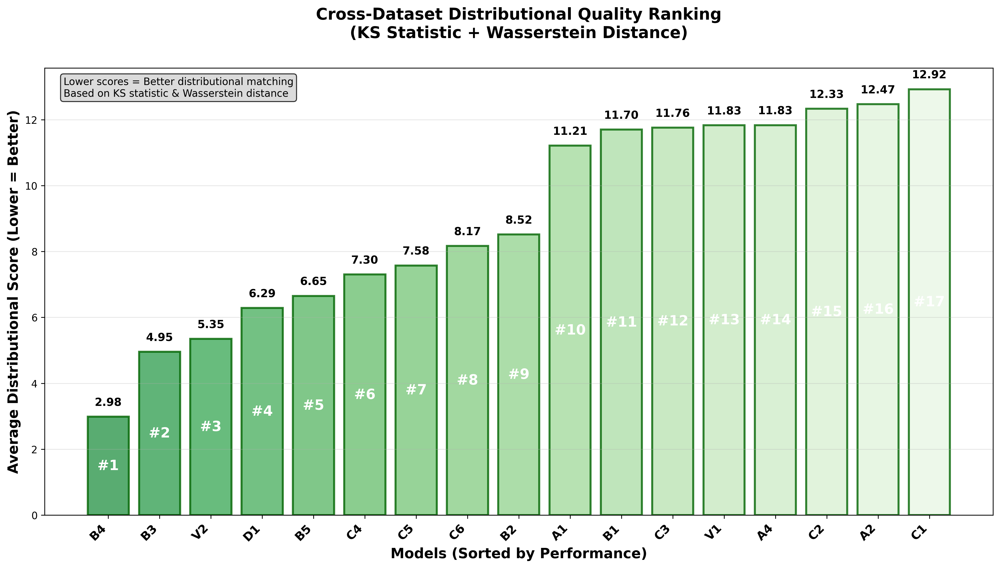
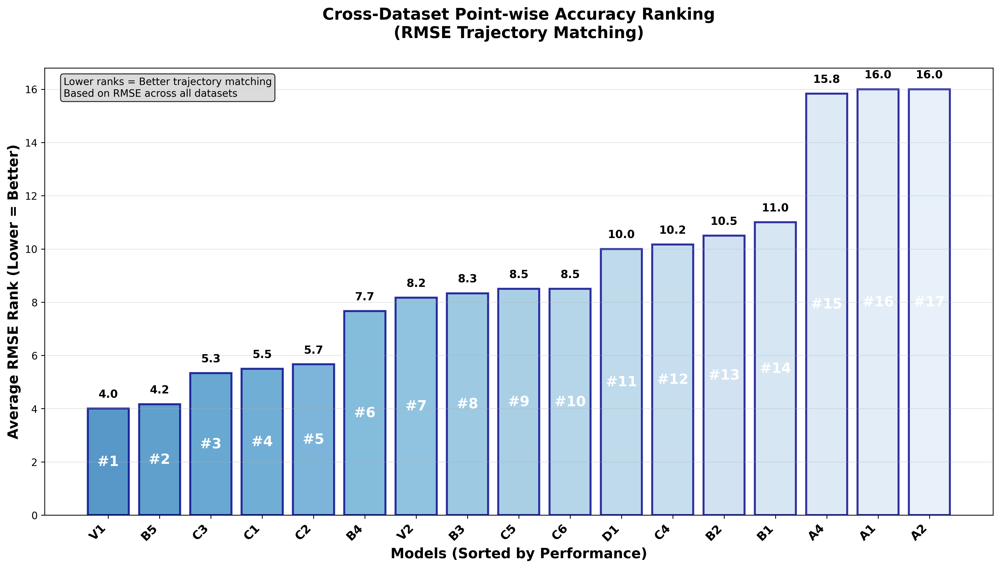

# Signature-Based Deep Learning for Stochastic Process Generation

A comprehensive comparison of signature-based methods for time series generation, including both non-adversarial and adversarial training approaches across multiple stochastic processes.

## 🏆 Model Performance Rankings

### Complete Model Performance (15 Models Across 8 Datasets)

| Rank | Model | Training Type | Weighted Score | Best Use Case |
|------|-------|---------------|----------------|---------------|
| 🥇 | **B4** | Non-Adversarial | **3.93** | **General-purpose champion** |
| 🥈 | **B3** | Non-Adversarial | **4.64** | **Mean-reverting processes** |
| 🥉 | **B2** | Non-Adversarial | **5.38** | **Advanced PDE-solved signatures** |
| 4th | **B5_ADV** | ⚔️ Adversarial | **5.40** | **🏆 Best adversarial model** |
| 5th | **B1** | Non-Adversarial | **5.91** | **PDE-solved scoring** |
| 6th | **B2_ADV** | ⚔️ Adversarial | **6.29** | **Adversarial MMD (PDE)** |
| 7th | **B1_ADV** | ⚔️ Adversarial | **8.40** | **Adversarial scoring (PDE)** |
| 8th | **B5** | Non-Adversarial | **8.49** | **Fast Neural SDE** |
| 9th | **A4** | Non-Adversarial | **8.99** | **Log signature experiments** |
| 10th | **B4_ADV** | ⚔️ Adversarial | **9.05** | **Adversarial MMD** |
| 11th | **A1** | Non-Adversarial | **9.32** | **Baseline comparison** |
| 12th | **A2_ADV** | ⚔️ Adversarial | **9.82** | **Adversarial CannedNet scoring** |
| 13th | **A3_ADV** | ⚔️ Adversarial | **10.25** | **Adversarial CannedNet MMD** |
| 14th | **A2** | Non-Adversarial | **11.00** | **CannedNet scoring baseline** |
| 15th | **A3** | Non-Adversarial | **13.14** | **CannedNet MMD baseline** |

*Rankings based on distributional quality (KS statistic + Wasserstein distance) across 8 stochastic processes*

### Model Architecture Details

#### Non-Adversarial Models (9 models)
- **A1-A4**: CannedNet generator + Various losses (T-Statistic, Scoring, MMD)
- **B1-B5**: Neural SDE generator + Various losses + Signature methods

#### Adversarial Models (6 models)  
- **A2_ADV, A3_ADV**: CannedNet + Adversarial discriminators
- **B1_ADV, B2_ADV, B4_ADV, B5_ADV**: Neural SDE + Adversarial discriminators

*Note: T-statistic models (A1, B3) cannot be used with adversarial training due to signature dimension conflicts*

## 🚀 Quick Start

### Environment Setup
```bash
# Activate the conda environment
conda activate sig19

# Navigate to project directory
cd /path/to/signature_comparisons
```

### Training Models

#### Non-Adversarial Training
```bash
# Train all models on all datasets (recommended)
python src/experiments/train_and_save_models.py --epochs 100

# Train on specific dataset
python src/experiments/train_and_save_models.py --dataset ou_process --epochs 100
python src/experiments/train_and_save_models.py --dataset heston --epochs 100

# Force retrain existing models
python src/experiments/train_and_save_models.py --retrain-all --epochs 100
```

#### Adversarial Training
```bash
# Train all working adversarial models (memory-efficient)
python src/experiments/adversarial_training.py --all --epochs 100 --memory-efficient

# Train specific adversarial models
python src/experiments/adversarial_training.py --models B4 B5 --epochs 50 --memory-efficient

# Force retrain adversarial models
python src/experiments/adversarial_training.py --all --force-retrain --epochs 50 --memory-efficient
```

### Model Evaluation

#### Complete Evaluation Pipeline
```bash
# Evaluate all models (both non-adversarial and adversarial)
python src/experiments/enhanced_model_evaluation.py

# Generate cross-dataset rankings and clean plots
python src/experiments/multi_dataset_evaluation.py
```

### Key Results Files

After evaluation, you'll find:

#### Cross-Dataset Analysis
- `results/cross_dataset_analysis/distributional_quality_ranking.png` - Clean distributional ranking
- `results/cross_dataset_analysis/rmse_accuracy_ranking.png` - Clean RMSE ranking
- `results/cross_dataset_analysis/rough_vs_nonrough_analysis.png` - ✨ **NEW** Rough vs non-rough process analysis
- `results/cross_dataset_analysis/rough_vs_nonrough_side_by_side.png` - ✨ **NEW** Side-by-side rough vs non-rough comparison
- `results/cross_dataset_analysis/overall_model_summary.csv` - Complete performance data
- `results/cross_dataset_analysis/rough_datasets_rankings.csv` - ✨ **NEW** Rankings on rough processes only
- `results/cross_dataset_analysis/nonrough_datasets_rankings.csv` - ✨ **NEW** Rankings on non-rough processes only

#### Adversarial vs Non-Adversarial Comparison  
- `results/adversarial_comparison/adversarial_vs_non_adversarial_comparison.png` - Side-by-side comparison

#### Individual Dataset Results
- `results/{dataset}/evaluation/enhanced_models_evaluation.csv` - Non-adversarial metrics
- `results/{dataset}_adversarial/evaluation/enhanced_models_evaluation.csv` - Adversarial metrics
- `results/{dataset}/evaluation/ultra_clear_trajectory_visualization.png` - Trajectory plots

## 📊 Key Results

### Cross-Dataset Performance Analysis
Our evaluation system generates clean, publication-ready visualizations:

#### Distributional Quality Ranking

*Clean ranking based on KS statistic and Wasserstein distance across all datasets*

#### RMSE Accuracy Ranking  

*Point-wise trajectory matching performance across all datasets*

#### Adversarial vs Non-Adversarial Comparison

*Direct side-by-side comparison of adversarial and non-adversarial training*

#### Example: Trajectory Quality Analysis

*Generated trajectories vs ground truth for OU Process dataset (20 samples per model)*

#### Rough vs Non-Rough Process Analysis

*Model performance comparison on rough processes (rBergomi, FBM H<0.5) vs non-rough processes (OU, Heston, Brownian, FBM H≥0.5)*

#### Side-by-Side Rough vs Non-Rough Comparison

*Clean comparison of distributional quality (KS + Wasserstein) on rough vs non-rough stochastic processes*

### Evaluation Coverage
- **15 models** evaluated (9 non-adversarial + 6 adversarial)
- **8 stochastic processes** tested
- **120 total evaluations** completed
- **4 key metrics** per evaluation (RMSE, KS statistic, Wasserstein distance, Std RMSE)

## 📋 Supported Datasets

### 🌊 Rough Processes (H < 0.5 or inherently rough)
- **rbergomi** - Rough Bergomi volatility model
- **fbm_h03** - Fractional Brownian Motion (H=0.3, anti-persistent)
- **fbm_h04** - Fractional Brownian Motion (H=0.4, anti-persistent)

### 🏔️ Non-Rough Processes (H ≥ 0.5 or smooth)
- **ou_process** - Ornstein-Uhlenbeck (mean-reverting)
- **heston** - Heston stochastic volatility
- **brownian** - Standard Brownian motion (H=0.5, neutral)
- **fbm_h06** - Fractional Brownian Motion (H=0.6, persistent)
- **fbm_h07** - Fractional Brownian Motion (H=0.7, persistent)

*Rough processes exhibit anti-persistence and irregular/jagged paths, while non-rough processes have smoother, more predictable behavior.*

## 🎯 Model Recommendations

### For General Use
- **Champion**: B4 (Neural SDE + MMD) - Best overall performance
- **Runner-up**: B3 (Neural SDE + T-Statistic) - Excellent for mean-reverting processes
- **Best Adversarial**: B5_ADV (Neural SDE + Adversarial Scoring) - Top adversarial performance

### For Specific Process Types
- **Mean-Reverting (OU-like)**: B3, B4
- **Financial/Volatility (Heston, rBergomi)**: A1, A2  
- **Simple Diffusion (Brownian)**: A1, A2
- **Unknown Process Type**: B4 (safest choice)

## 🔧 Using Individual Models

```python
import sys
sys.path.append('src')
import torch
from utils.model_checkpoint import create_checkpoint_manager

# Load any trained model
checkpoint_manager = create_checkpoint_manager('results')
model = checkpoint_manager.load_model('B4')  # or B3, A1, etc.

# Generate samples
samples = model.generate_samples(100)
print(f"Generated samples: {samples.shape}")
```

## 📁 Repository Structure

```
signature_comparisons/
├── src/
│   ├── models/                    # Model implementations
│   ├── experiments/               # Training and evaluation scripts
│   ├── losses/                    # Loss function implementations
│   └── signatures/                # Signature computation methods
├── results/                       # Generated results and plots
└── README.md                      # This file
```

## 🎯 Key Findings

- **Neural SDE generators** significantly outperform CannedNet architectures
- **B4 (Neural SDE + MMD)** is the overall champion across all datasets
- **Adversarial training** shows mixed results - only B5_ADV competitive with top non-adversarial models
- **Multi-dataset validation** is critical - single dataset results can be misleading
- **120 total evaluations** completed (15 models × 8 datasets)

---

*This framework provides the most comprehensive systematic comparison of signature-based deep learning methods for stochastic process generation.*