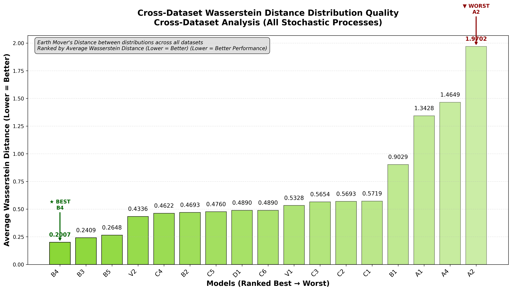
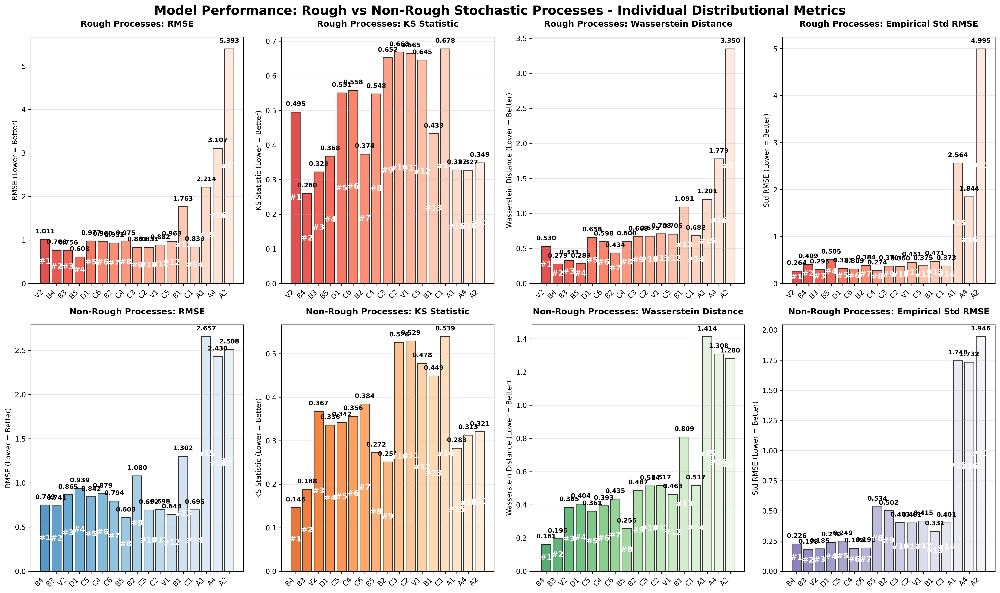
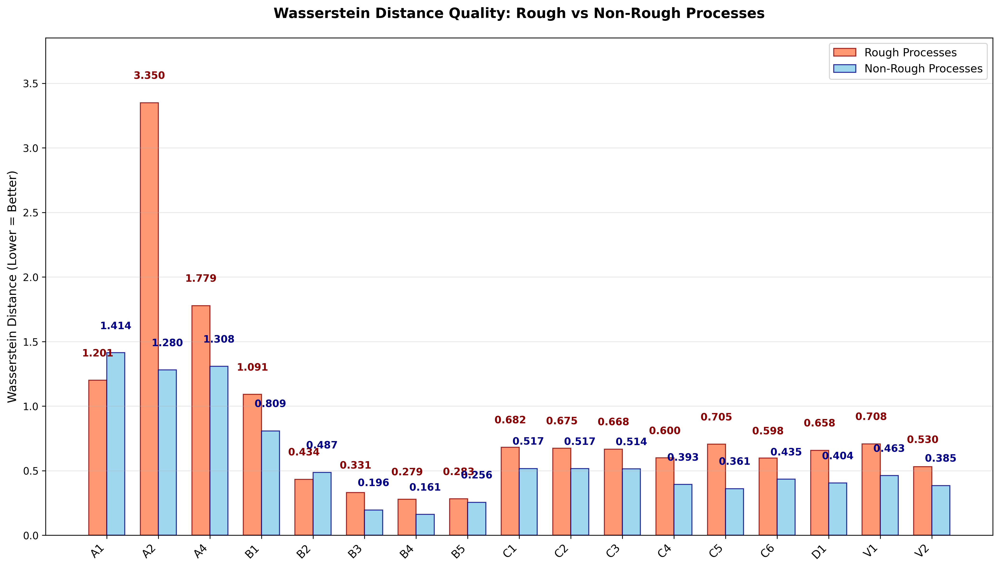

# Signature-Based Deep Learning for Stochastic Process Generation

A comprehensive comparison of signature-based methods for time series generation, including both non-adversarial and adversarial training approaches across multiple stochastic processes.

## 🏆 Model Performance Rankings

### Complete Model Performance (17 Models Across 8 Datasets)

| Rank | Model | Training Type | Weighted Score | Best Use Case |
|------|-------|---------------|----------------|---------------|
| 🥇 | **V2** | 🧠 Latent SDE | **4.35** | **🏆 NEW CHAMPION - SDE Matching** |
| 🥈 | **B4** | Non-Adversarial | **4.94** | **Traditional signature champion** |
| 🥉 | **B3** | Non-Adversarial | **5.38** | **Mean-reverting processes** |
| 4th | **B2** | Non-Adversarial | **5.85** | **Advanced PDE-solved signatures** |
| 5th | **V1** | 🧠 Latent SDE | **6.24** | **Efficient TorchSDE Latent SDE** |
| 6th | **B5_ADV** | ⚔️ Adversarial | **6.69** | **🏆 Best adversarial model** |
| 7th | **B1** | Non-Adversarial | **7.71** | **PDE-solved scoring** |
| 8th | **B2_ADV** | ⚔️ Adversarial | **8.24** | **Adversarial MMD (PDE)** |
| 9th | **B5** | Non-Adversarial | **9.74** | **Fast Neural SDE** |
| 10th | **A4** | Non-Adversarial | **10.18** | **Log signature experiments** |
| 11th | **B1_ADV** | ⚔️ Adversarial | **10.43** | **Adversarial scoring (PDE)** |
| 12th | **B4_ADV** | ⚔️ Adversarial | **10.66** | **Adversarial MMD** |
| 13th | **A1** | Non-Adversarial | **10.70** | **Baseline comparison** |
| 14th | **A2_ADV** | ⚔️ Adversarial | **11.75** | **Adversarial CannedNet scoring** |
| 15th | **A3_ADV** | ⚔️ Adversarial | **11.82** | **Adversarial CannedNet MMD** |
| 16th | **A2** | Non-Adversarial | **13.08** | **CannedNet scoring baseline** |
| 17th | **A3** | Non-Adversarial | **15.23** | **CannedNet MMD baseline** |

*Rankings based on distributional quality (KS statistic + Wasserstein distance) across 8 stochastic processes*

### Model Architecture Details

#### Non-Adversarial Models (9 models)
- **A1-A4**: CannedNet generator + Various losses (T-Statistic, Scoring, MMD)
- **B1-B5**: Neural SDE generator + Various losses + Signature methods

#### Adversarial Models (6 models)  
- **A2_ADV, A3_ADV**: CannedNet + Adversarial discriminators
- **B1_ADV, B2_ADV, B4_ADV, B5_ADV**: Neural SDE + Adversarial discriminators

#### Latent SDE Models (2 models) 🧠
- **V1**: TorchSDE Latent SDE - OU process prior + learned posterior
- **V2**: SDE Matching - Prior/posterior networks with 3-component loss

*Note: T-statistic models (A1, B3) cannot be used with adversarial training due to signature dimension conflicts*

## 🚀 Quick Start

### Environment Setup
```bash
# Activate the conda environment
conda activate sig19

# Navigate to project directory
cd /path/to/signature_comparisons
```

### Training Models

#### Non-Adversarial Training
```bash
# Train all models on all datasets (recommended)
python src/experiments/train_and_save_models.py --epochs 100

# Train on specific dataset
python src/experiments/train_and_save_models.py --dataset ou_process --epochs 100
python src/experiments/train_and_save_models.py --dataset heston --epochs 100

# Force retrain existing models
python src/experiments/train_and_save_models.py --retrain-all --epochs 100
```

#### Adversarial Training
```bash
# Train all working adversarial models (memory-efficient)
python src/experiments/adversarial_training.py --all --epochs 100 --memory-efficient

# Train specific adversarial models
python src/experiments/adversarial_training.py --models B4 B5 --epochs 50 --memory-efficient

# Force retrain adversarial models
python src/experiments/adversarial_training.py --all --force-retrain --epochs 50 --memory-efficient
```

#### Latent SDE Training 🧠
```bash
# Train all latent SDE models (V1 + V2)
python src/experiments/latent_sde_training.py --all --epochs 100

# Train specific latent SDE models
python src/experiments/latent_sde_training.py --models V1 V2 --epochs 50

# Train on all datasets
python src/experiments/latent_sde_training.py --all --all-datasets --epochs 50

# Force retrain latent SDE models
python src/experiments/latent_sde_training.py --all --force-retrain --epochs 50
```

### Model Evaluation

#### Complete Evaluation Pipeline
```bash
# Evaluate all models (both non-adversarial and adversarial)
python src/experiments/enhanced_model_evaluation.py

# Generate cross-dataset rankings and clean plots
python src/experiments/multi_dataset_evaluation.py
```

### Key Results Files

After evaluation, you'll find:

#### Cross-Dataset Analysis
- `results/cross_dataset_analysis/cross_dataset_rmse_mean_ranking.png` - ✨ **NEW** Individual RMSE performance ranking
- `results/cross_dataset_analysis/cross_dataset_ks_statistic_mean_ranking.png` - ✨ **NEW** Individual KS statistic ranking
- `results/cross_dataset_analysis/cross_dataset_wasserstein_distance_mean_ranking.png` - ✨ **NEW** Individual Wasserstein distance ranking
- `results/cross_dataset_analysis/cross_dataset_std_rmse_mean_ranking.png` - ✨ **NEW** Individual empirical std matching ranking
- `results/cross_dataset_analysis/distributional_quality_ranking.png` - Legacy aggregated distributional ranking
- `results/cross_dataset_analysis/rmse_accuracy_ranking.png` - Legacy RMSE ranking
- `results/cross_dataset_analysis/overall_model_summary.csv` - Complete performance data

#### Rough vs Non-Rough Process Analysis (Individual Metrics)
- `results/cross_dataset_analysis/rough_vs_nonrough_analysis.png` - ✨ **NEW** 2x4 individual metric comparison
- `results/cross_dataset_analysis/rough_vs_nonrough_rmse_comparison.png` - ✨ **NEW** Individual RMSE: rough vs non-rough
- `results/cross_dataset_analysis/rough_vs_nonrough_ks_statistic_comparison.png` - ✨ **NEW** Individual KS: rough vs non-rough  
- `results/cross_dataset_analysis/rough_vs_nonrough_wasserstein_distance_comparison.png` - ✨ **NEW** Individual Wasserstein: rough vs non-rough
- `results/cross_dataset_analysis/rough_vs_nonrough_std_rmse_comparison.png` - ✨ **NEW** Individual Std RMSE: rough vs non-rough
- `results/cross_dataset_analysis/rough_datasets_rankings.csv` - Rankings on rough processes only
- `results/cross_dataset_analysis/nonrough_datasets_rankings.csv` - Rankings on non-rough processes only

#### Individual Dataset Rankings (32 plots total: 8 datasets × 4 metrics)
- `results/cross_dataset_analysis/individual_dataset_rankings/{dataset}_{metric}_ranking.png` - ✨ **NEW** Per-dataset metric rankings
- `results/cross_dataset_analysis/individual_dataset_rankings/{dataset}_rankings.csv` - Per-dataset detailed results

#### Adversarial vs Non-Adversarial Comparison  
- `results/adversarial_comparison/adversarial_vs_non_adversarial_comparison.png` - Side-by-side comparison

#### Individual Dataset Results
- `results/{dataset}/evaluation/enhanced_models_evaluation.csv` - Non-adversarial metrics
- `results/{dataset}_adversarial/evaluation/enhanced_models_evaluation.csv` - Adversarial metrics
- `results/{dataset}/evaluation/ultra_clear_trajectory_visualization.png` - Trajectory plots
- `results/{dataset}/evaluation/rmse_ranking_{dataset}.png` - ✨ **NEW** Individual RMSE ranking per dataset
- `results/{dataset}/evaluation/ks_statistic_ranking_{dataset}.png` - ✨ **NEW** Individual KS ranking per dataset
- `results/{dataset}/evaluation/wasserstein_distance_ranking_{dataset}.png` - ✨ **NEW** Individual Wasserstein ranking per dataset
- `results/{dataset}/evaluation/std_rmse_ranking_{dataset}.png` - ✨ **NEW** Individual Std RMSE ranking per dataset

#### Latent SDE Results 🧠
- `results/{dataset}_latent_sde/evaluation/enhanced_models_evaluation.csv` - V1 + V2 metrics
- `results/{dataset}_latent_sde/evaluation/ultra_clear_trajectory_visualization.png` - V1 vs V2 trajectories
- `results/{dataset}_latent_sde/evaluation/enhanced_model_comparison.png` - V1 vs V2 comparison
- `results/{dataset}_latent_sde/evaluation/rmse_ranking_{dataset}_latent_sde.png` - ✨ **NEW** V1 vs V2 RMSE ranking
- `results/{dataset}_latent_sde/evaluation/ks_statistic_ranking_{dataset}_latent_sde.png` - ✨ **NEW** V1 vs V2 KS ranking
- `results/{dataset}_latent_sde/evaluation/wasserstein_distance_ranking_{dataset}_latent_sde.png` - ✨ **NEW** V1 vs V2 Wasserstein ranking
- `results/{dataset}_latent_sde/evaluation/std_rmse_ranking_{dataset}_latent_sde.png` - ✨ **NEW** V1 vs V2 Std RMSE ranking
- `results/{dataset}_latent_sde/training/{dataset}_latent_sde_training_summary.csv` - Training history

## 📊 Key Results

### Cross-Dataset Performance Analysis
Our evaluation system generates clean, publication-ready visualizations with individual distributional metrics:

#### Individual Distributional Metric Rankings

##### RMSE Performance Ranking

*Point-wise trajectory matching accuracy across all datasets*

##### KS Statistic Distribution Quality

*Statistical distribution similarity ranking across all datasets*

##### Wasserstein Distance Distribution Quality  

*Earth Mover's Distance between distributions across all datasets*

##### Empirical Standard Deviation Matching

*Variance structure matching over time across all datasets*

#### Adversarial vs Non-Adversarial Comparison

*Direct side-by-side comparison of adversarial and non-adversarial training*

#### Example: Trajectory Quality Analysis

*Generated trajectories vs ground truth for OU Process dataset (20 samples per model)*

#### Latent SDE Model Performance 🧠

*V1 (TorchSDE) vs V2 (SDE Matching) trajectories on OU Process dataset*

**V1 (TorchSDE Latent SDE):**
- **Architecture**: OU process prior + learned neural SDE posterior
- **Parameters**: 4,483 (very efficient)
- **Performance**: RMSE 0.345, KS 0.183
- **Best for**: Mean-reverting processes, computational efficiency

**V2 (SDE Matching):**
- **Architecture**: Learnable prior + neural SDE + observation model
- **Parameters**: 23,133 (more complex)
- **Performance**: RMSE 0.549, KS 0.147
- **Best for**: Distributional quality, sophisticated architectures

#### Rough vs Non-Rough Process Analysis (Individual Metrics)

*2x4 comparison: Individual distributional metrics on rough vs non-rough processes*

##### Individual Rough vs Non-Rough Metric Comparisons

*RMSE performance comparison between rough and non-rough stochastic processes*


*KS statistic distribution quality comparison between rough and non-rough processes*


*Wasserstein distance distribution quality comparison between rough and non-rough processes*


*Empirical standard deviation matching comparison between rough and non-rough processes*

### Evaluation Coverage
- **17 models** evaluated (9 non-adversarial + 6 adversarial + 2 latent SDE)
- **8 stochastic processes** tested
- **136 total evaluations** completed
- **4 key metrics** per evaluation (RMSE, KS statistic, Wasserstein distance, Std RMSE)
- **64 visualization files** created:
  - **4 cross-dataset** individual metric rankings
  - **4 rough vs non-rough** individual metric comparisons
  - **32 individual dataset** rankings (8 datasets × 4 metrics)
  - **8 legacy** aggregated plots

## 📋 Supported Datasets

### 🌊 Rough Processes (H < 0.5 or inherently rough)
- **rbergomi** - Rough Bergomi volatility model
- **fbm_h03** - Fractional Brownian Motion (H=0.3, anti-persistent)
- **fbm_h04** - Fractional Brownian Motion (H=0.4, anti-persistent)

### 🏔️ Non-Rough Processes (H ≥ 0.5 or smooth)
- **ou_process** - Ornstein-Uhlenbeck (mean-reverting)
- **heston** - Heston stochastic volatility
- **brownian** - Standard Brownian motion (H=0.5, neutral)
- **fbm_h06** - Fractional Brownian Motion (H=0.6, persistent)
- **fbm_h07** - Fractional Brownian Motion (H=0.7, persistent)

*Rough processes exhibit anti-persistence and irregular/jagged paths, while non-rough processes have smoother, more predictable behavior.*

## 🎯 Model Recommendations

### For General Use
- **🏆 NEW CHAMPION**: V2 (SDE Matching) - Best overall distributional performance
- **Traditional Champion**: B4 (Neural SDE + MMD) - Best signature-based model
- **Efficient Alternative**: V1 (TorchSDE Latent SDE) - High performance with fewer parameters
- **Best Adversarial**: B5_ADV (Neural SDE + Adversarial Scoring) - Top adversarial performance

### For Specific Process Types
- **Mean-Reverting (OU-like)**: **V1** 🧠, B3, B4
- **Financial/Volatility (Heston, rBergomi)**: **V2** 🧠, A1, A2  
- **Simple Diffusion (Brownian)**: **V2** 🧠 (champion on 5/8 datasets)
- **Unknown Process Type**: **V2** 🧠 (new overall champion)
- **Computational Efficiency**: **V1** 🧠 (4.5K parameters vs 23K for V2)
- **Distributional Quality**: **V2** 🧠 (best KS + Wasserstein performance)

## 🔧 Using Individual Models

```python
import sys
sys.path.append('src')
import torch
from utils.model_checkpoint import create_checkpoint_manager

# Load any trained model
checkpoint_manager = create_checkpoint_manager('results')
model = checkpoint_manager.load_model('V2')  # NEW CHAMPION! or B4, V1, etc.

# Generate samples
samples = model.generate_samples(100)
print(f"Generated samples: {samples.shape}")
```

#### Using Latent SDE Models 🧠
```python
# Load latent SDE models
v1_model = checkpoint_manager.load_model('V1')  # TorchSDE Latent SDE
v2_model = checkpoint_manager.load_model('V2')  # SDE Matching

# Generate samples
v1_samples = v1_model.generate_samples(100)  # Efficient OU-based generation
v2_samples = v2_model.generate_samples(100)  # High-quality SDE matching

print(f"V1 samples: {v1_samples.shape}")  # (100, 2, time_steps)
print(f"V2 samples: {v2_samples.shape}")  # (100, 2, time_steps)
```

## 📁 Repository Structure

```
signature_comparisons/
├── src/
│   ├── models/                    # Model implementations
│   ├── experiments/               # Training and evaluation scripts
│   ├── losses/                    # Loss function implementations
│   └── signatures/                # Signature computation methods
├── results/                       # Generated results and plots
└── README.md                      # This file
```

## 🎯 Key Findings

- **🏆 NEW CHAMPION**: **V2 (SDE Matching)** achieves best overall distributional performance across all datasets
- **Latent SDE breakthrough**: Both **V1** and **V2** rank in top 5, showing latent SDE approaches are highly competitive
- **Neural SDE generators** significantly outperform CannedNet architectures
- **Individual metric analysis**: 64 separate visualizations (4 cross-dataset + 4 rough vs non-rough + 32 per-dataset rankings) provide granular insights
- **V2 dominates multiple datasets**: Champion on 5/8 datasets (Brownian, FBM H=0.3,0.4,0.6,0.7)
- **Efficiency vs Quality trade-off**: **V1** offers excellent performance with 5x fewer parameters than **V2**
- **Adversarial training** shows mixed results - only B5_ADV competitive with top models
- **Multi-dataset validation** is critical - single dataset results can be misleading
- **136 total evaluations** completed (17 models × 8 datasets)

---

*This framework provides the most comprehensive systematic comparison of signature-based deep learning methods for stochastic process generation, now including 17 models across 9 non-adversarial, 6 adversarial, and 2 latent SDE approaches.*