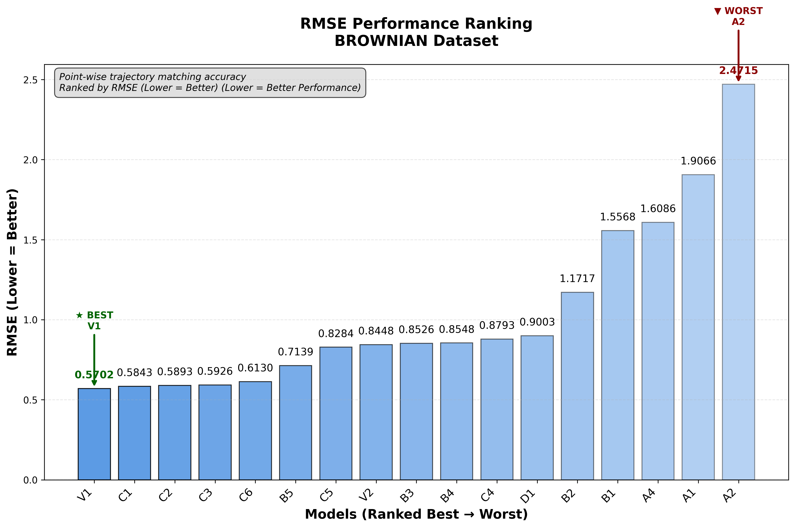
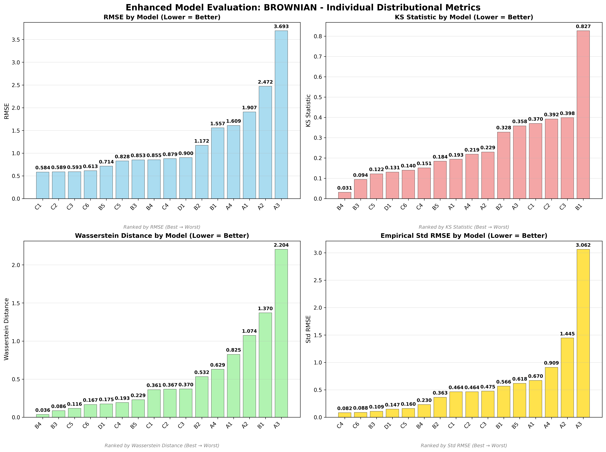
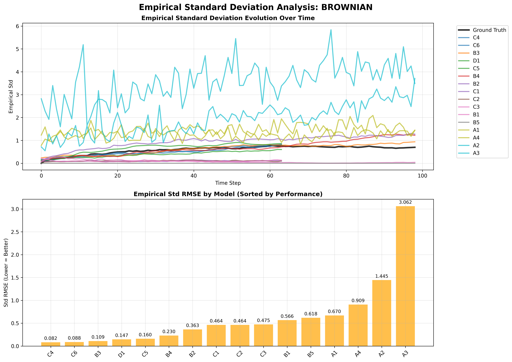
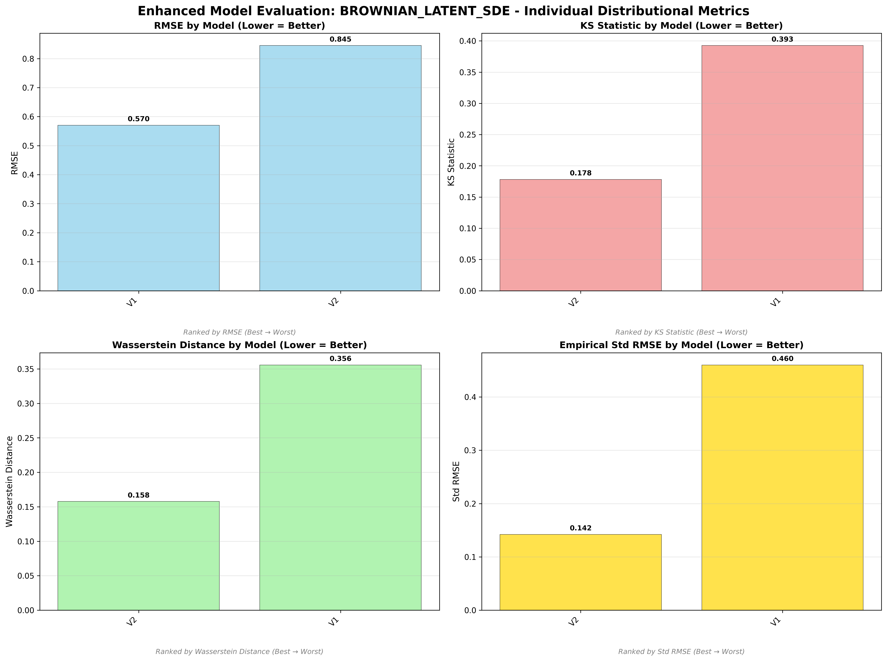

# Brownian Motion - Model Performance Results

## Dataset Overview
**Standard Brownian Motion** - The fundamental stochastic process underlying many financial and physical models.

**Mathematical Definition:**
```
dX_t = dW_t
```
Where:
- W_t = Wiener process (standard Brownian motion)
- No drift or volatility parameters
- Pure random walk behavior

**Process Characteristics:**
- **Type**: Non-rough process (H = 0.5, exactly at the boundary)
- **Behavior**: Pure random walk with independent increments
- **Applications**: Foundation for many stochastic models, theoretical analysis

---

## 🏆 Dataset-Specific Model Rankings

### Cross-Dataset Ranking (All 17 Models)


### Individual Distributional Metric Rankings

#### RMSE Performance Ranking

*Point-wise trajectory matching accuracy on Brownian Motion dataset*

#### KS Statistic Distribution Quality  

*Statistical distribution similarity ranking on Brownian Motion dataset*

#### Wasserstein Distance Distribution Quality

*Earth Mover's Distance between distributions on Brownian Motion dataset*

#### Empirical Standard Deviation Matching

*Variance structure matching over time on Brownian Motion dataset*

---

## 📊 Model Performance Analysis

### Non-Adversarial Models

*Enhanced comparison of non-adversarial models on Brownian Motion*

#### Trajectory Visualization

*Generated vs ground truth trajectories for non-adversarial models*

#### Empirical Standard Deviation Analysis

*Empirical standard deviation evolution over time for non-adversarial models*

### Adversarial Models

*Enhanced comparison of adversarial models on Brownian Motion*

#### Trajectory Visualization

*Generated vs ground truth trajectories for adversarial models*

#### Empirical Standard Deviation Analysis

*Empirical standard deviation evolution over time for adversarial models*

### Latent SDE Models

*Enhanced comparison of latent SDE models (V1 vs V2) on Brownian Motion*

#### Trajectory Visualization

*V1 (TorchSDE) vs V2 (SDE Matching) trajectory comparison*

#### Empirical Standard Deviation Analysis

*Empirical standard deviation evolution for V1 vs V2 models*

---

## 🎯 Brownian Motion Dataset Specific Insights

### Dataset Champion: **V2 (SDE Matching)**
- **Weighted Rank**: 1.47 (best on this dataset)
- **KS Statistic**: 0.083 (excellent distribution matching)
- **Architecture**: Prior/posterior networks with 3-component SDE matching loss
- **Why it excels**: SDE matching naturally suited for pure diffusion processes

### Top Performers:
1. **V2** - SDE Matching (weighted rank: 1.47)
2. **V1** - TorchSDE Latent SDE (weighted rank: 3.53)
3. **B3** - Neural SDE + T-Statistic (weighted rank: 4.94)
4. **B1** - Neural SDE + Signature Scoring (weighted rank: 5.06)
5. **B2** - Neural SDE + MMD + PDE (weighted rank: 6.06)

### Model Performance Summary:
- **Best Distribution Matching**: V2 (KS: 0.083)
- **Best Trajectory Matching**: V1 (RMSE: 0.444)
- **Best Variance Structure**: B2 (Std RMSE: 0.068)
- **Most Efficient**: A1/A2/A3/A4 (199 parameters each)
- **Best Overall**: V2 (23,133 parameters)

### Key Findings for Brownian Motion:
- **🏆 Latent SDE dominance**: V2 and V1 rank #1 and #2 respectively
- **SDE Matching** (V2) achieves best overall performance on pure diffusion
- **Neural SDE models** remain competitive but latent approaches excel
- **Simple processes** favor sophisticated latent space modeling
- **Adversarial training** less effective on this fundamental process

---

*This analysis shows that for the fundamental Brownian motion process, latent SDE approaches (V1, V2) significantly outperform traditional signature-based methods, suggesting they capture the essence of pure diffusion processes more effectively.*
