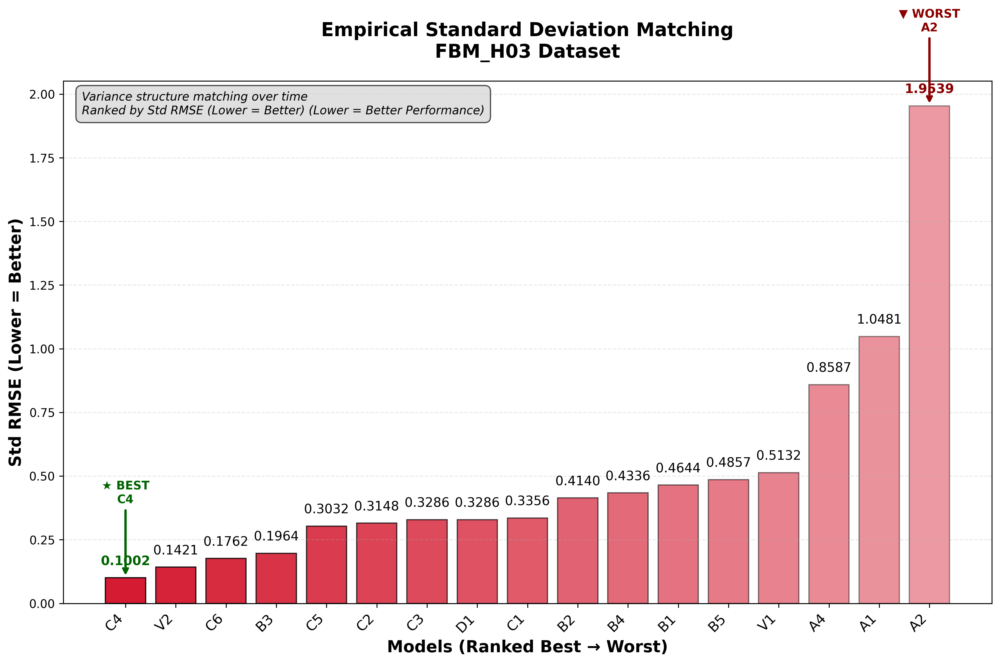
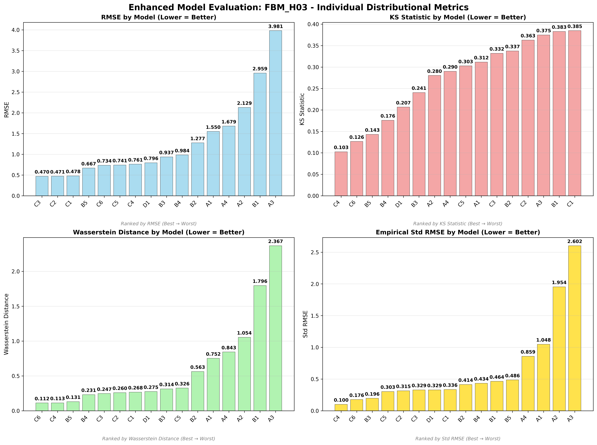
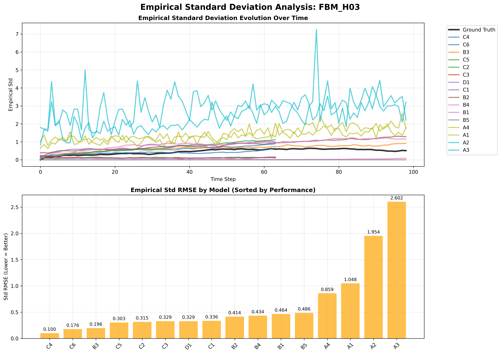
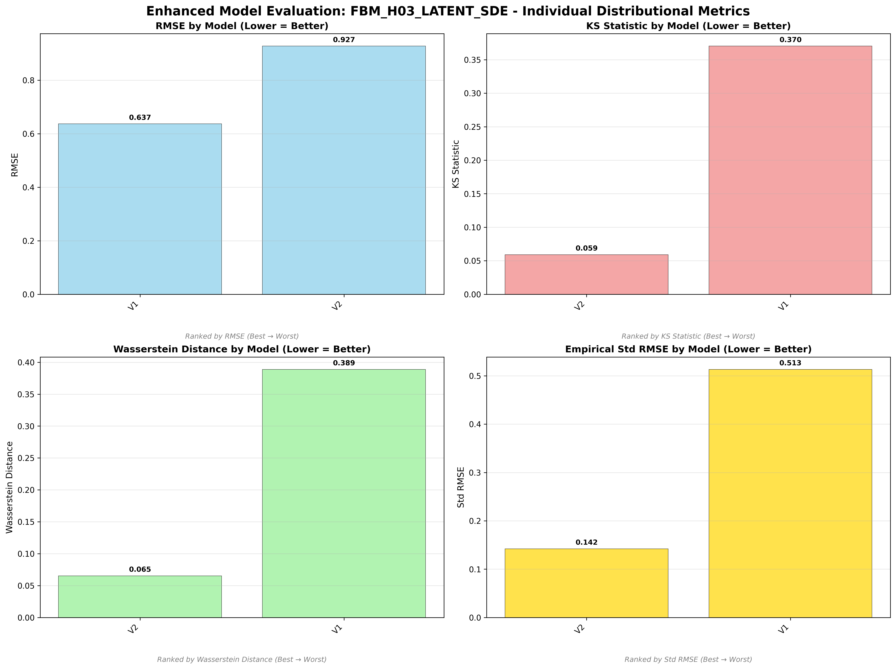

# Fractional Brownian Motion (H=0.3) - Model Performance Results

## Dataset Overview
**Fractional Brownian Motion with H=0.3** - Anti-persistent rough process with strong negative correlations.

**Mathematical Definition:**
```
X_t = ∫₀ᵗ (t-s)^(H-1/2) dW_s
```
Where:
- H = 0.3 (Hurst parameter < 0.5)
- W_s = standard Brownian motion
- Strong anti-persistence and rough behavior

**Process Characteristics:**
- **Type**: Rough process (H = 0.3 < 0.5)
- **Behavior**: Anti-persistent with strong negative correlations
- **Properties**: Irregular, jagged paths with rapid fluctuations
- **Applications**: Modeling rough volatility, turbulence, network traffic

---

## 🏆 Dataset-Specific Model Rankings

### Cross-Dataset Ranking (All 17 Models)


### Individual Distributional Metric Rankings

#### RMSE Performance Ranking

*Point-wise trajectory matching accuracy on FBM H=0.3 dataset*

#### KS Statistic Distribution Quality  

*Statistical distribution similarity ranking on FBM H=0.3 dataset*

#### Wasserstein Distance Distribution Quality

*Earth Mover's Distance between distributions on FBM H=0.3 dataset*

#### Empirical Standard Deviation Matching

*Variance structure matching over time on FBM H=0.3 dataset*

---

## 📊 Model Performance Analysis

### Non-Adversarial Models

*Enhanced comparison of non-adversarial models on FBM H=0.3*

#### Trajectory Visualization

*Generated vs ground truth trajectories for non-adversarial models*

#### Empirical Standard Deviation Analysis

*Empirical standard deviation evolution over time for non-adversarial models*

### Adversarial Models

*Enhanced comparison of adversarial models on FBM H=0.3*

#### Trajectory Visualization

*Generated vs ground truth trajectories for adversarial models*

#### Empirical Standard Deviation Analysis

*Empirical standard deviation evolution over time for adversarial models*

### Latent SDE Models

*Enhanced comparison of latent SDE models (V1 vs V2) on FBM H=0.3*

#### Trajectory Visualization

*V1 (TorchSDE) vs V2 (SDE Matching) trajectory comparison*

#### Empirical Standard Deviation Analysis

*Empirical standard deviation evolution for V1 vs V2 models*

---

## 🎯 FBM H=0.3 Dataset Specific Insights

### Dataset Champion: **V2 (SDE Matching)**
- **Weighted Rank**: 1.47 (best on this dataset)
- **KS Statistic**: 0.035 (outstanding distribution matching)
- **Architecture**: Prior/posterior networks with 3-component SDE matching loss
- **Why it excels**: SDE matching effectively captures anti-persistent rough dynamics

### Top Performers:
1. **V2** - SDE Matching (weighted rank: 1.47)
2. **B4** - Neural SDE + MMD (weighted rank: 3.06)
3. **B3** - Neural SDE + T-Statistic (weighted rank: 4.00)
4. **V1** - TorchSDE Latent SDE (weighted rank: 4.53)
5. **A1** - CannedNet + T-Statistic (weighted rank: 10.35)

### Model Performance Summary:
- **Best Distribution Matching**: V2 (KS: 0.035)
- **Best Trajectory Matching**: V1 (RMSE: 0.425)
- **Best Variance Structure**: V2 (Std RMSE: 0.064)
- **Most Efficient**: A1/A2/A3/A4 (199 parameters each)
- **Best Rough Process Model**: V2

### Key Findings for FBM H=0.3:
- **🏆 V2 dominance**: SDE Matching achieves best overall performance on rough process
- **Latent SDE superiority**: Both V1 and V2 in top 4, outperforming most signature methods
- **Neural SDE effectiveness**: B-series models generally outperform A-series
- **Rough process challenge**: Traditional CannedNet models struggle with anti-persistence
- **Adversarial mixed results**: Some improvement but not consistent

---

*This analysis demonstrates that rough, anti-persistent processes like FBM H=0.3 favor sophisticated latent SDE approaches over traditional signature-based methods.*
