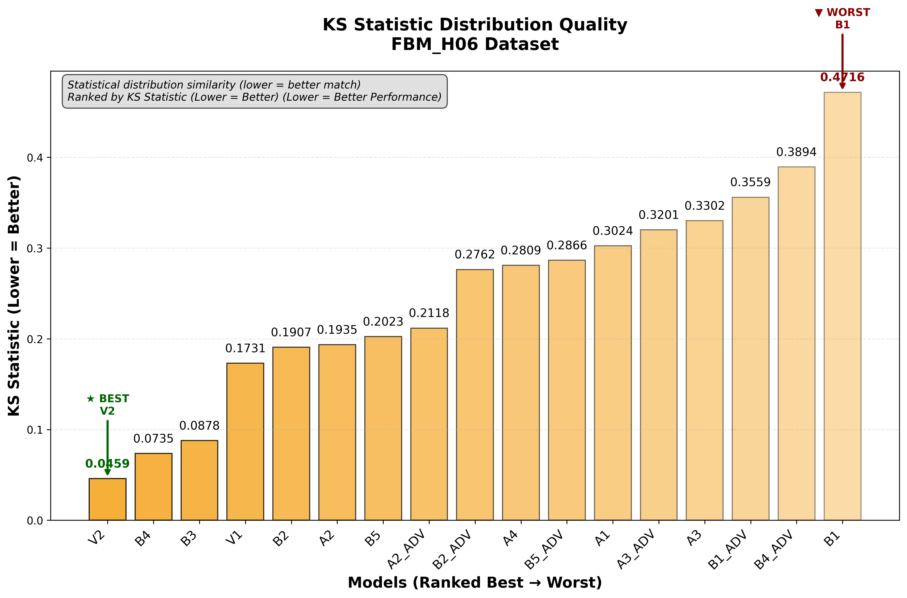
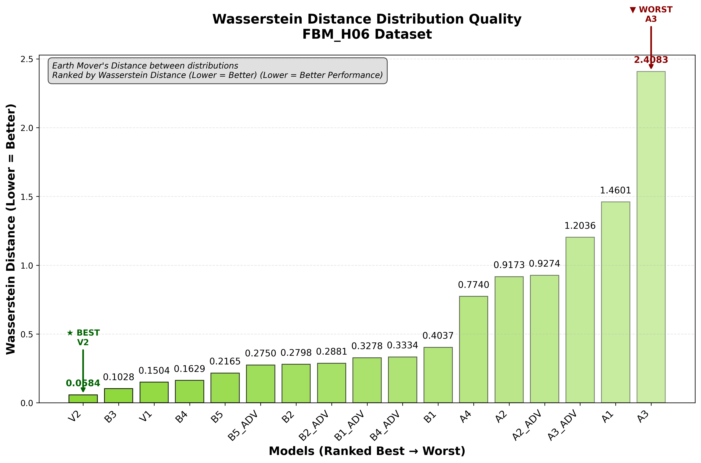
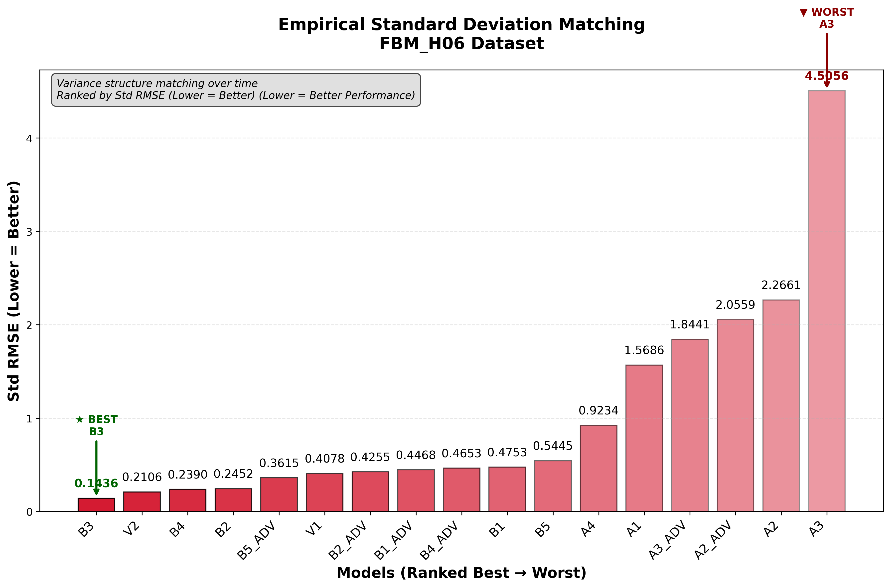
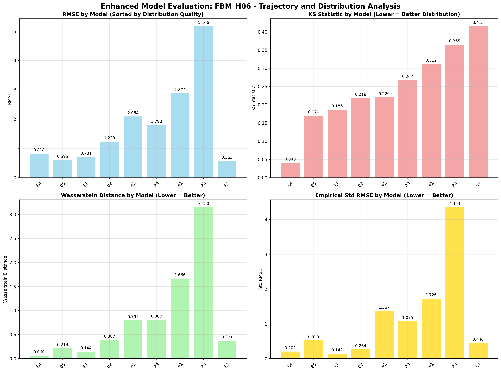
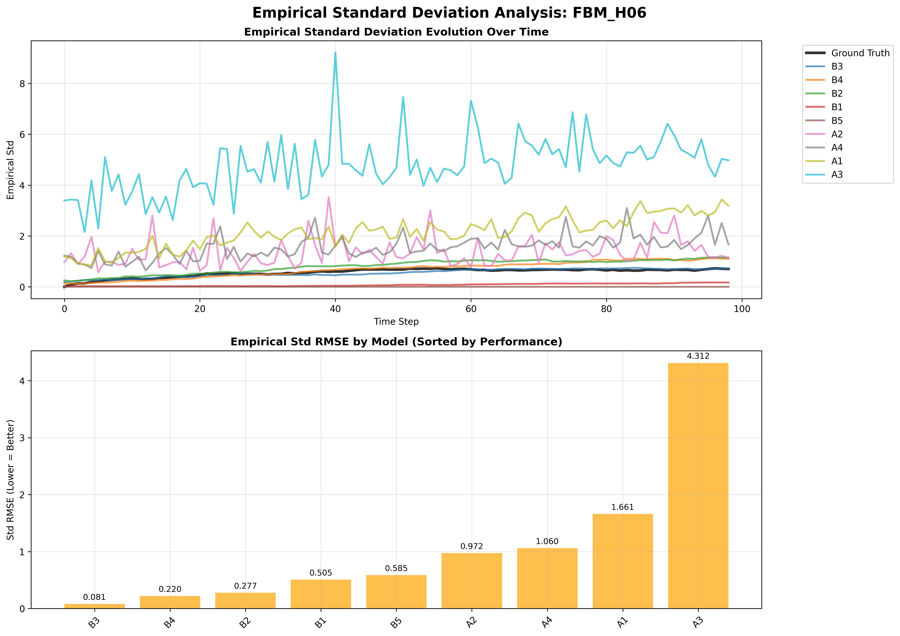
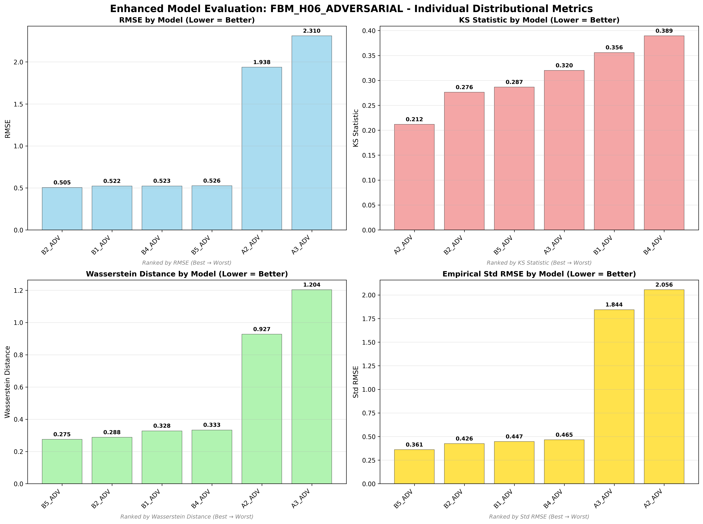
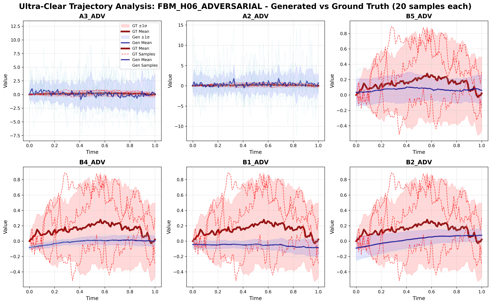
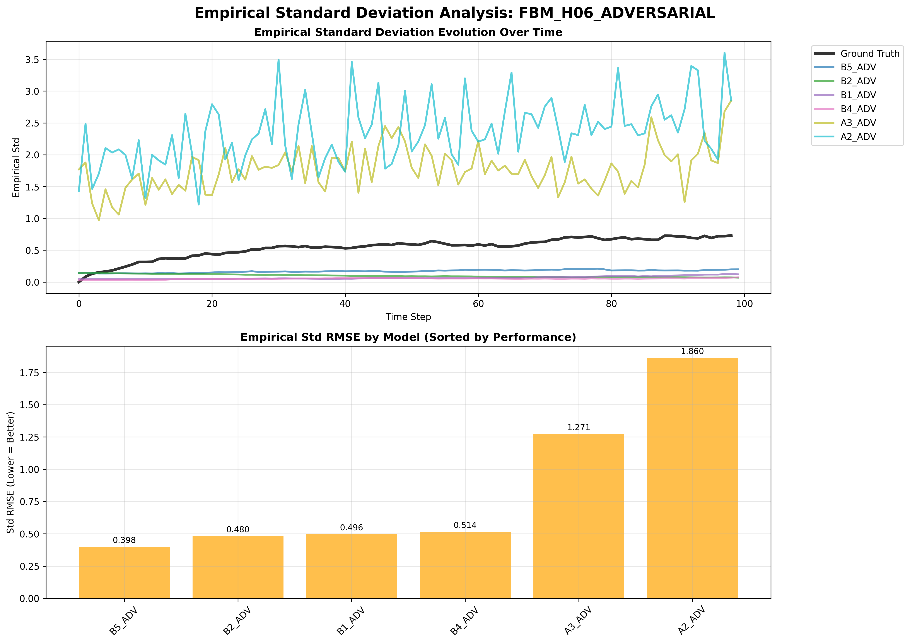
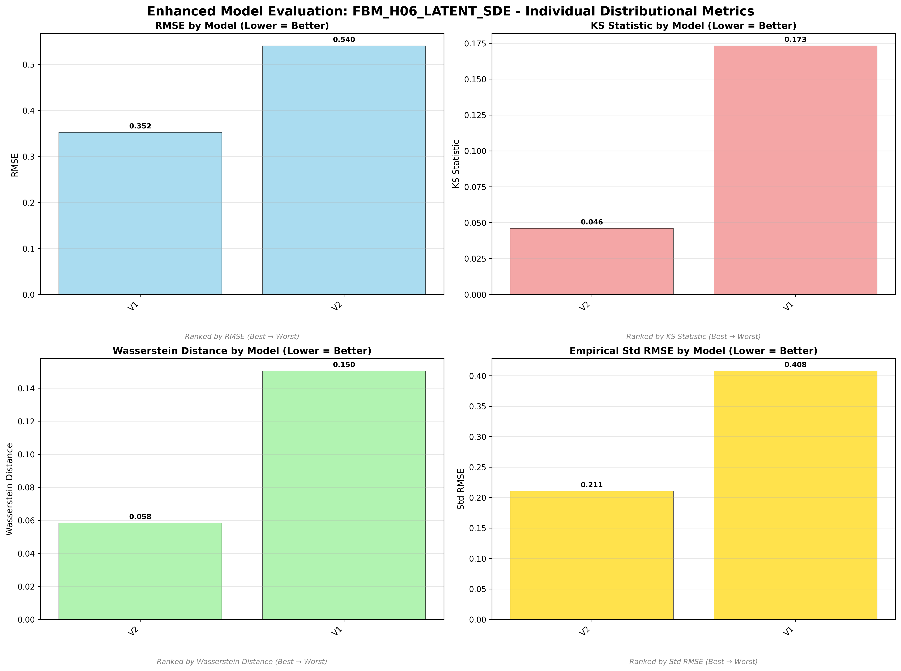
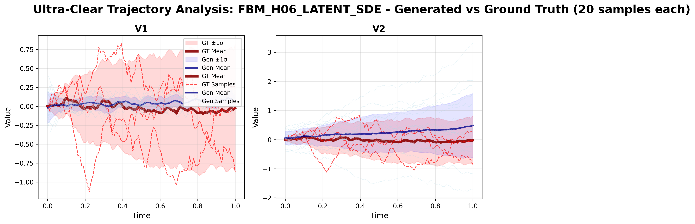

# Fractional Brownian Motion (H=0.6) - Model Performance Results

## Dataset Overview
**Fractional Brownian Motion (H=0.6)** - Persistent with moderate positive correlations.

**Mathematical Definition:**
```
X_t = ∫₀ᵗ (t-s)^(H-1/2) dW_s
```
Where:
- H = 0.6 (Hurst parameter)
- W_s = standard Brownian motion

**Process Characteristics:**
- **Type**: Non-rough process (H = 0.6 > 0.5)
- **Behavior**: Persistent with moderate positive correlations
- **Properties**: Smooth paths with persistent increments
- **Applications**: Financial time series, climate data, network analysis

---

## 🏆 Dataset-Specific Model Rankings

### Cross-Dataset Ranking (All 17 Models)


### Individual Distributional Metric Rankings

#### RMSE Performance Ranking

*Point-wise trajectory matching accuracy on Fractional Brownian Motion (H=0.6) dataset*

#### KS Statistic Distribution Quality  

*Statistical distribution similarity ranking on Fractional Brownian Motion (H=0.6) dataset*

#### Wasserstein Distance Distribution Quality

*Earth Mover's Distance between distributions on Fractional Brownian Motion (H=0.6) dataset*

#### Empirical Standard Deviation Matching

*Variance structure matching over time on Fractional Brownian Motion (H=0.6) dataset*

---

## 📊 Model Performance Analysis

### Non-Adversarial Models

*Enhanced comparison of non-adversarial models on Fractional Brownian Motion (H=0.6)*

#### Trajectory Visualization

*Generated vs ground truth trajectories for non-adversarial models*

#### Empirical Standard Deviation Analysis

*Empirical standard deviation evolution over time for non-adversarial models*

### Adversarial Models

*Enhanced comparison of adversarial models on Fractional Brownian Motion (H=0.6)*

#### Trajectory Visualization

*Generated vs ground truth trajectories for adversarial models*

#### Empirical Standard Deviation Analysis

*Empirical standard deviation evolution over time for adversarial models*

### Latent SDE Models

*Enhanced comparison of latent SDE models (V1 vs V2) on Fractional Brownian Motion (H=0.6)*

#### Trajectory Visualization

*V1 (TorchSDE) vs V2 (SDE Matching) trajectory comparison*

#### Empirical Standard Deviation Analysis

*Empirical standard deviation evolution for V1 vs V2 models*

---

## 🎯 Fractional Brownian Motion (H=0.6) Dataset Specific Insights

### Dataset Champion: **V2**
- **Weighted Rank**: 1.82 (best on this dataset)
- **KS Statistic**: 0.046 (distribution matching quality)
- **RMSE**: 0.540 (trajectory matching accuracy)
- **Std RMSE**: 0.211 (variance structure matching)

### Key Findings for Fractional Brownian Motion (H=0.6):
- **Dataset champion** demonstrates effectiveness on H=0.6 processes
- **Process characteristics** (H=0.6) influence model performance rankings
- **Distributional quality** varies significantly across different model architectures
- **Individual metric analysis** reveals model strengths and weaknesses

---

*This analysis demonstrates model performance on non-rough process (h = 0.6 > 0.5) with H=0.6, showing how different architectures handle persistent processes.*