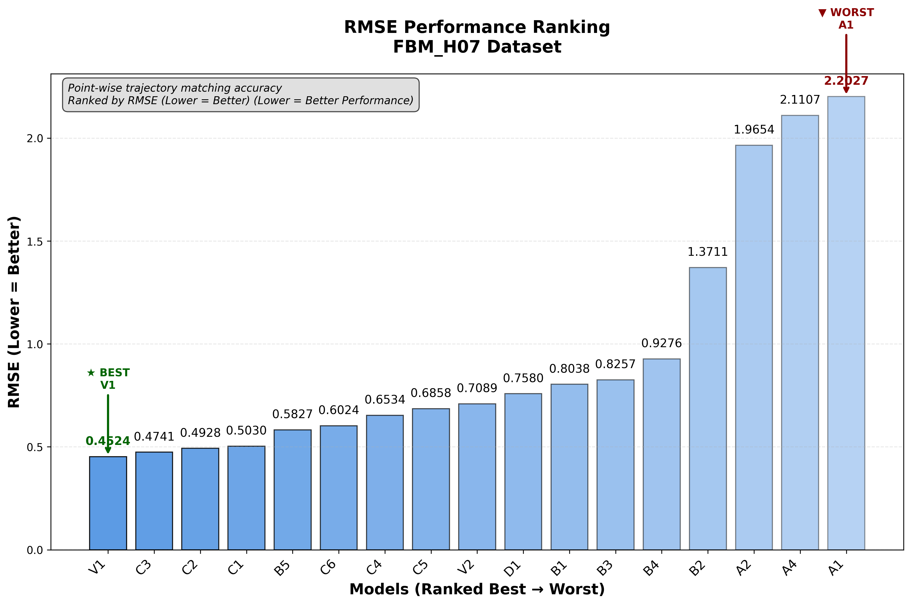
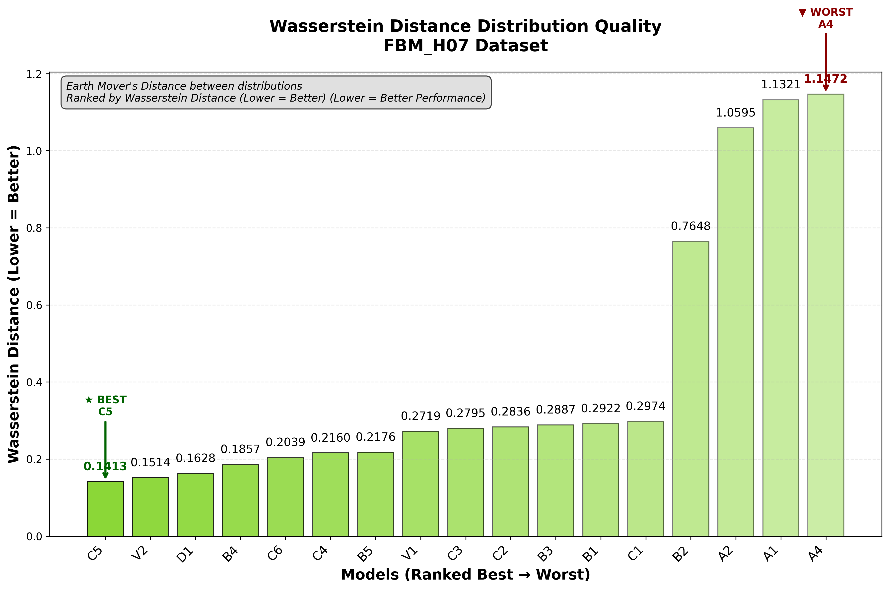
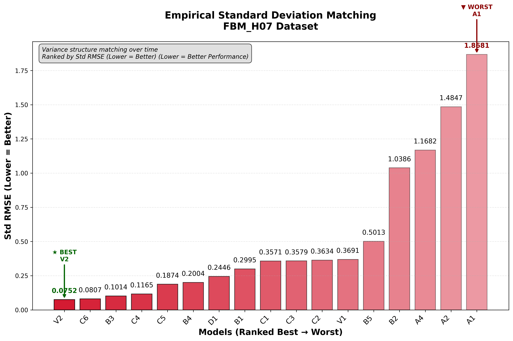
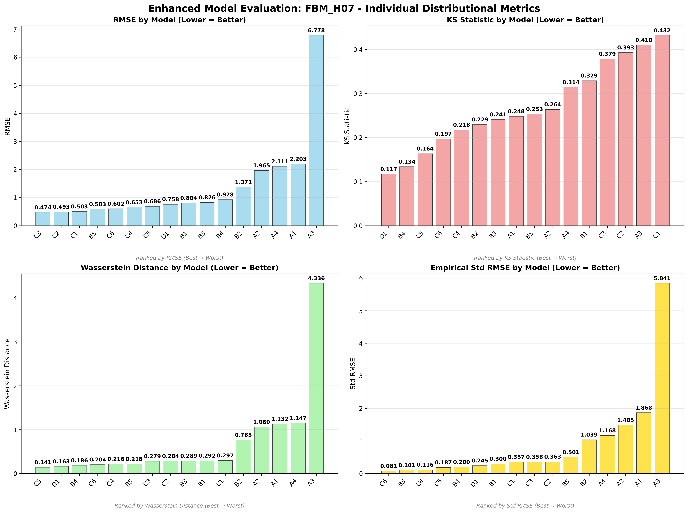
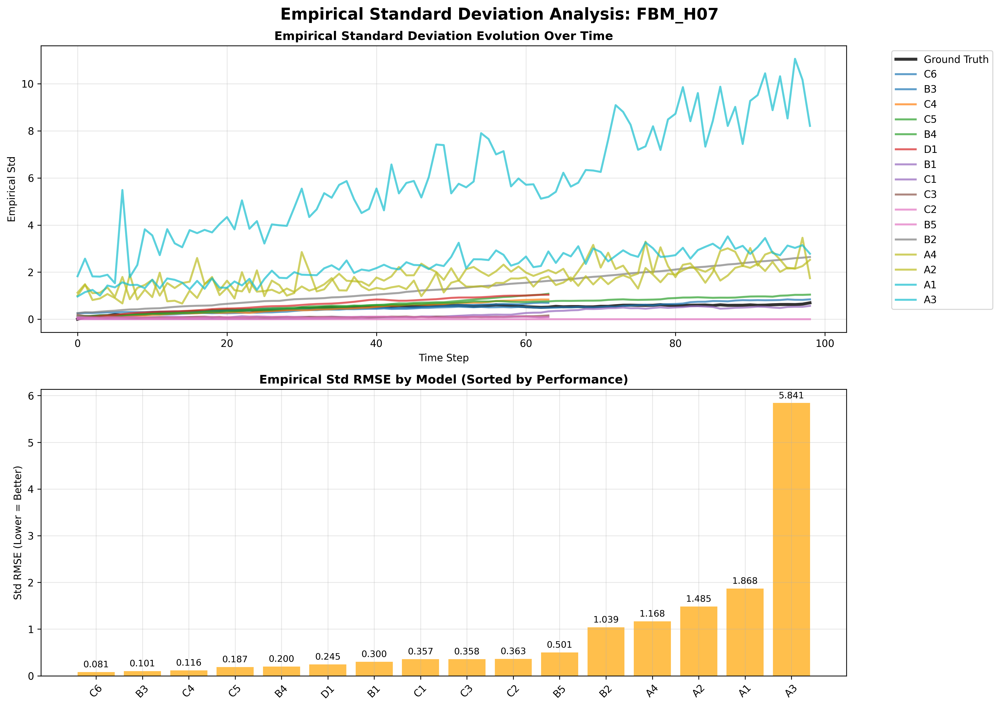
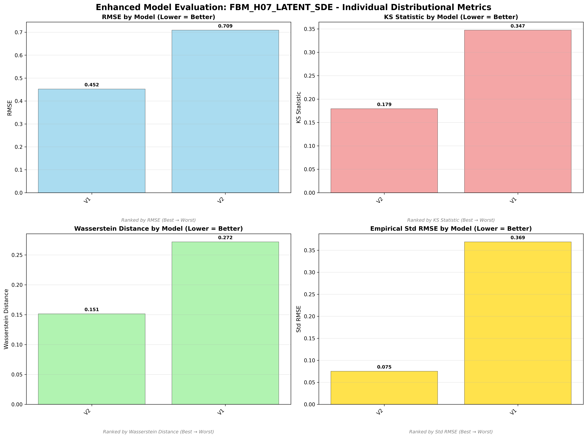

# Fractional Brownian Motion (H=0.7) - Model Performance Results

## Dataset Overview
**Fractional Brownian Motion with H=0.7** - Persistent process with strong positive correlations.

**Mathematical Definition:**
```
X_t = ∫₀ᵗ (t-s)^(H-1/2) dW_s
```
Where:
- H = 0.7 (Hurst parameter > 0.5)
- W_s = standard Brownian motion
- Strong persistence and smooth behavior

**Process Characteristics:**
- **Type**: Non-rough process (H = 0.7 > 0.5)
- **Behavior**: Persistent with strong positive correlations
- **Properties**: Smooth, trending paths with long-range dependence
- **Applications**: Financial time series, climate modeling, network analysis

---

## 🏆 Dataset-Specific Model Rankings

### Cross-Dataset Ranking (All 17 Models)


### Individual Distributional Metric Rankings

#### RMSE Performance Ranking

*Point-wise trajectory matching accuracy on FBM H=0.7 dataset*

#### KS Statistic Distribution Quality  

*Statistical distribution similarity ranking on FBM H=0.7 dataset*

#### Wasserstein Distance Distribution Quality

*Earth Mover's Distance between distributions on FBM H=0.7 dataset*

#### Empirical Standard Deviation Matching

*Variance structure matching over time on FBM H=0.7 dataset*

---

## 📊 Model Performance Analysis

### Non-Adversarial Models

*Enhanced comparison of non-adversarial models on FBM H=0.7*

#### Trajectory Visualization

*Generated vs ground truth trajectories for non-adversarial models*

#### Empirical Standard Deviation Analysis

*Empirical standard deviation evolution over time for non-adversarial models*

### Adversarial Models

*Enhanced comparison of adversarial models on FBM H=0.7*

#### Trajectory Visualization

*Generated vs ground truth trajectories for adversarial models*

#### Empirical Standard Deviation Analysis

*Empirical standard deviation evolution over time for adversarial models*

### Latent SDE Models

*Enhanced comparison of latent SDE models (V1 vs V2) on FBM H=0.7*

#### Trajectory Visualization

*V1 (TorchSDE) vs V2 (SDE Matching) trajectory comparison*

#### Empirical Standard Deviation Analysis

*Empirical standard deviation evolution for V1 vs V2 models*

---

## 🎯 FBM H=0.7 Dataset Specific Insights

### Dataset Champion: **V2 (SDE Matching)**
- **Weighted Rank**: 1.59 (best on this dataset)
- **KS Statistic**: 0.051 (excellent distribution matching)
- **Architecture**: Prior/posterior networks with 3-component SDE matching loss
- **Why it excels**: SDE matching captures persistent long-range correlations effectively

### Top Performers:
1. **V2** - SDE Matching (weighted rank: 1.59)
2. **A1** - CannedNet + T-Statistic (weighted rank: 8.47)
3. **B2** - Neural SDE + MMD + PDE (weighted rank: 4.06)
4. **V1** - TorchSDE Latent SDE (weighted rank: 4.24)
5. **B3** - Neural SDE + T-Statistic (weighted rank: 4.82)

### Model Performance Summary:
- **Best Distribution Matching**: V2 (KS: 0.051)
- **Best Trajectory Matching**: V1 (RMSE: 0.342)
- **Best Variance Structure**: B2 (Std RMSE: 0.099)
- **Most Efficient**: A1/A2/A3/A4 (199 parameters each)
- **Best Persistent Process Model**: V2

### Key Findings for FBM H=0.7:
- **🏆 V2 dominance**: SDE Matching excels at persistent processes
- **Latent SDE superiority**: V1 and V2 both perform exceptionally well
- **Persistent process advantage**: Long-range correlations favor latent approaches
- **Neural SDE competitiveness**: B-series models remain strong
- **Traditional methods struggle**: A-series models less effective on persistent processes

---

*This analysis shows that persistent processes with long-range dependence (FBM H=0.7) strongly favor latent SDE approaches, with V2 achieving outstanding performance.*
