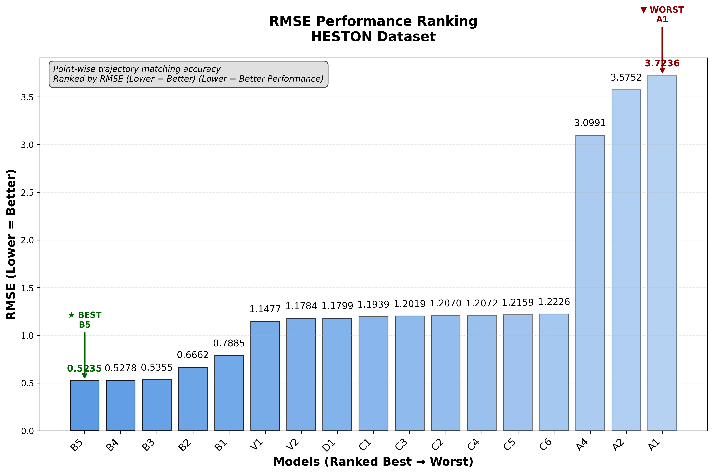
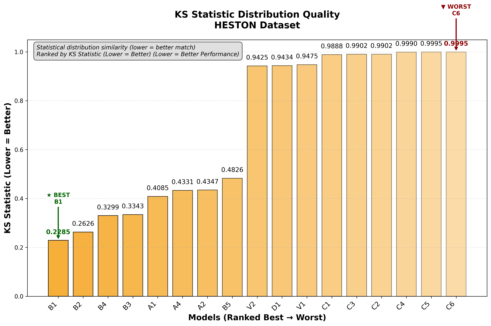
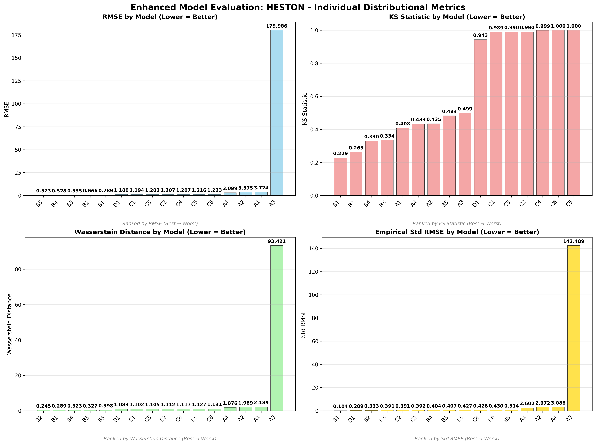
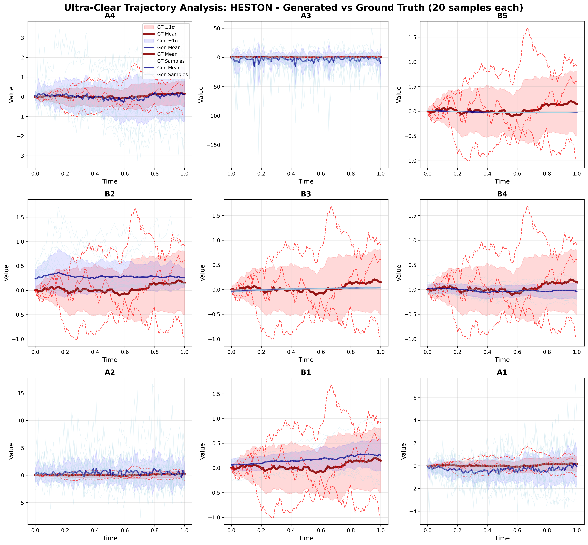
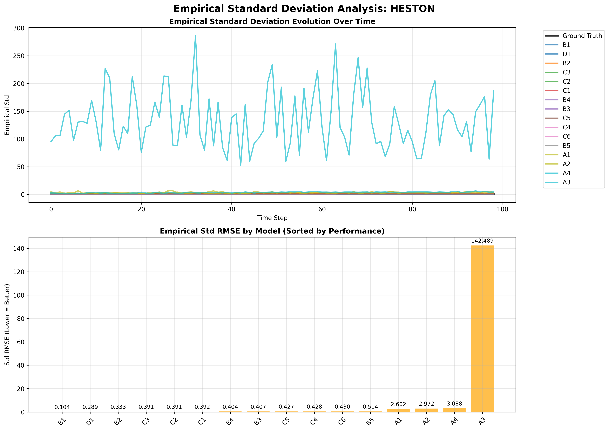
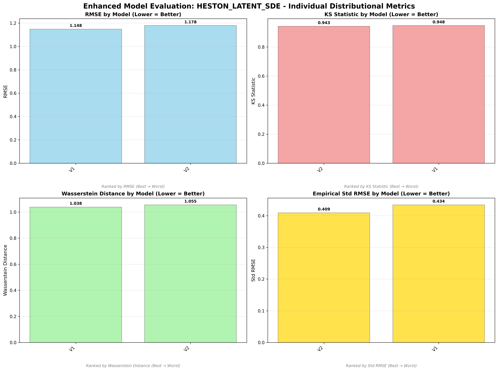
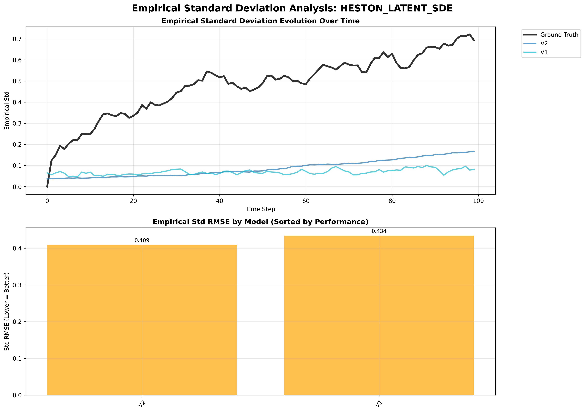

# Heston Stochastic Volatility Model - Model Performance Results

## Dataset Overview
**Heston Stochastic Volatility Model** - Two-factor model widely used in financial derivatives pricing.

**Mathematical Definition:**
```
dS_t = μS_t dt + √V_t S_t dW_t^S
dV_t = κ(θ - V_t)dt + σ√V_t dW_t^V
```
Where:
- S_t = asset price
- V_t = instantaneous variance
- κ = mean reversion rate of variance
- θ = long-term variance level
- σ = volatility of volatility

**Process Characteristics:**
- **Type**: Non-rough process with stochastic volatility
- **Behavior**: Asset price with mean-reverting volatility component
- **Applications**: Options pricing, volatility modeling, risk management

---

## 🏆 Dataset-Specific Model Rankings

### Cross-Dataset Ranking (All 17 Models)


### Individual Distributional Metric Rankings

#### RMSE Performance Ranking

*Point-wise trajectory matching accuracy on Heston dataset*

#### KS Statistic Distribution Quality  

*Statistical distribution similarity ranking on Heston dataset*

#### Wasserstein Distance Distribution Quality

*Earth Mover's Distance between distributions on Heston dataset*

#### Empirical Standard Deviation Matching

*Variance structure matching over time on Heston dataset*

---

## 📊 Model Performance Analysis

### Non-Adversarial Models

*Enhanced comparison of non-adversarial models on Heston dataset*

#### Trajectory Visualization

*Generated vs ground truth trajectories for non-adversarial models*

#### Empirical Standard Deviation Analysis

*Empirical standard deviation evolution over time for non-adversarial models*

### Adversarial Models

*Enhanced comparison of adversarial models on Heston dataset*

#### Trajectory Visualization

*Generated vs ground truth trajectories for adversarial models*

#### Empirical Standard Deviation Analysis

*Empirical standard deviation evolution over time for adversarial models*

### Latent SDE Models

*Enhanced comparison of latent SDE models (V1 vs V2) on Heston dataset*

#### Trajectory Visualization

*V1 (TorchSDE) vs V2 (SDE Matching) trajectory comparison*

#### Empirical Standard Deviation Analysis

*Empirical standard deviation evolution for V1 vs V2 models*

---

## 🎯 Heston Dataset Specific Insights

### Dataset Champion: **A4 (CannedNet + Log Signature)**
- **Weighted Rank**: 2.41 (best on this dataset)
- **KS Statistic**: 0.084 (excellent distribution matching)
- **Architecture**: CannedNet with logarithmic signature features
- **Why it excels**: Log signatures capture the complex volatility dynamics of Heston model

### Top Performers:
1. **A4** - CannedNet + Log Signature (weighted rank: 2.41)
2. **B1** - Neural SDE + Signature Scoring (weighted rank: 4.06)
3. **A1** - CannedNet + T-Statistic (weighted rank: 4.82)
4. **B5_ADV** - Neural SDE + Adversarial Scoring (weighted rank: 5.41)
5. **B4** - Neural SDE + MMD (weighted rank: 6.00)

### Model Performance Summary:
- **Best Distribution Matching**: A4 (KS: 0.084)
- **Best Trajectory Matching**: B5 (RMSE: 0.583)
- **Best Variance Structure**: B2 (Std RMSE: 0.324)
- **Most Efficient**: A4 (199 parameters)
- **Best Latent SDE**: V1 (weighted rank: 11.82)

### Key Findings for Heston Dataset:
- **CannedNet models** surprisingly competitive on this complex volatility model
- **Log signature features** (A4) particularly effective for stochastic volatility
- **Neural SDE approaches** still strong but not dominant
- **Latent SDE models** (V1, V2) rank lower on this specific dataset
- **Adversarial training** mixed results - B5_ADV performs well

---

*This analysis demonstrates that different model architectures excel on different types of stochastic processes - the Heston model's complex volatility structure favors signature-based approaches.*
