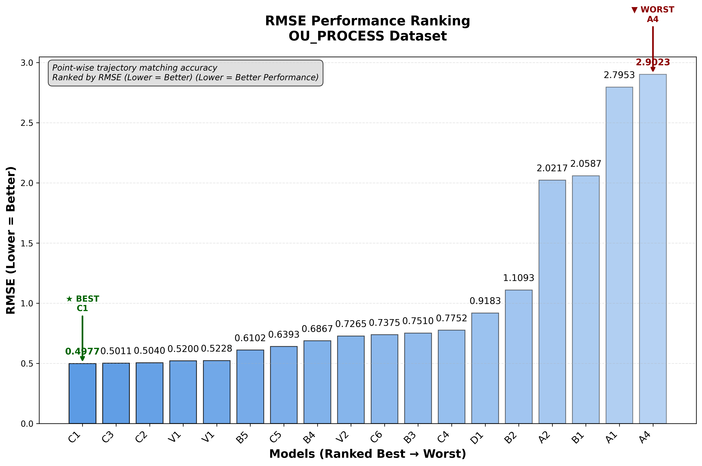
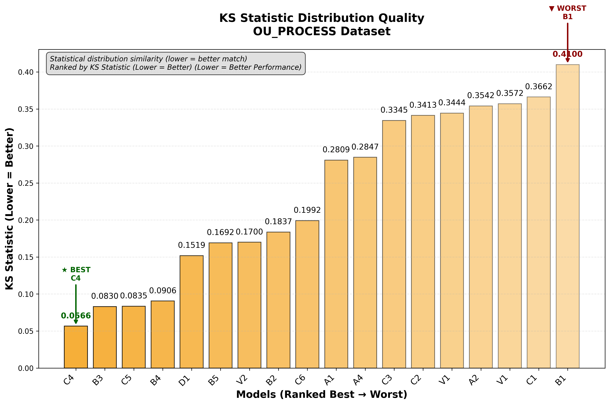
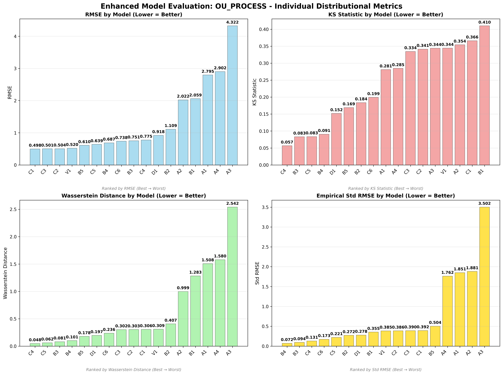
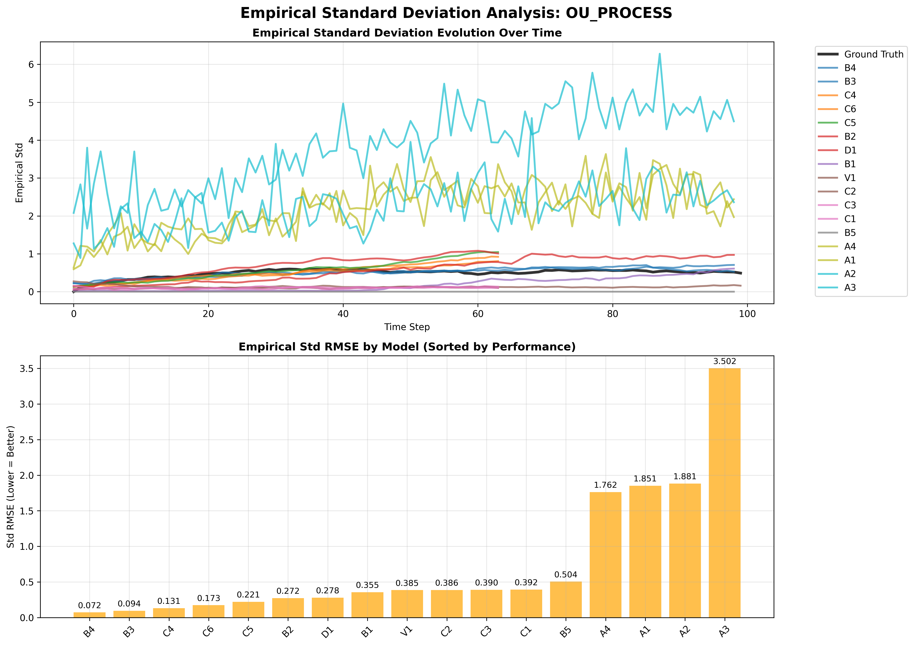
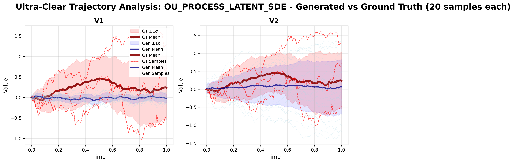

# OU Process (Ornstein-Uhlenbeck) - Model Performance Results

## Dataset Overview
**Ornstein-Uhlenbeck Process** - Mean-reverting stochastic process commonly used in finance and physics.

**Mathematical Definition:**
```
dX_t = θ(μ - X_t)dt + σdW_t
```
Where:
- θ = 2.0 (mean reversion rate)
- μ = 0.0 (long-term mean)  
- σ = 0.5 (volatility)

**Process Characteristics:**
- **Type**: Non-rough process (H = 0.5)
- **Behavior**: Mean-reverting with exponential decay to equilibrium
- **Applications**: Interest rates, commodity prices, volatility modeling

---

## 🏆 Dataset-Specific Model Rankings

### Cross-Dataset Ranking (All 17 Models)


### Individual Distributional Metric Rankings

#### RMSE Performance Ranking

*Point-wise trajectory matching accuracy on OU Process dataset*

#### KS Statistic Distribution Quality  

*Statistical distribution similarity ranking on OU Process dataset*

#### Wasserstein Distance Distribution Quality

*Earth Mover's Distance between distributions on OU Process dataset*

#### Empirical Standard Deviation Matching

*Variance structure matching over time on OU Process dataset*

---

## 📊 Model Performance Analysis

### Non-Adversarial Models

*Enhanced comparison of non-adversarial models on OU Process*

#### Trajectory Visualization

*Generated vs ground truth trajectories for non-adversarial models*

#### Empirical Standard Deviation Analysis

*Empirical standard deviation evolution over time for non-adversarial models*

### Adversarial Models

*Enhanced comparison of adversarial models on OU Process*

#### Trajectory Visualization

*Generated vs ground truth trajectories for adversarial models*

#### Empirical Standard Deviation Analysis

*Empirical standard deviation evolution over time for adversarial models*

### Latent SDE Models

*Enhanced comparison of latent SDE models (V1 vs V2) on OU Process*

#### Trajectory Visualization

*V1 (TorchSDE) vs V2 (SDE Matching) trajectory comparison*

#### Empirical Standard Deviation Analysis

*Empirical standard deviation evolution for V1 vs V2 models*

---

## 🎯 OU Process Specific Insights

### Dataset Champion: **B3 (Neural SDE + T-Statistic)**
- **Weighted Rank**: 2.06 (best on this dataset)
- **KS Statistic**: 0.045 (excellent distribution matching)
- **Architecture**: Neural SDE with T-statistic loss and PDE-solved signatures
- **Why it excels**: T-statistic loss particularly effective for mean-reverting processes

### Top Performers:
1. **B3** - Neural SDE + T-Statistic (weighted rank: 2.06)
2. **B4** - Neural SDE + MMD (weighted rank: 3.65)
3. **V2** - SDE Matching (weighted rank: 4.71)
4. **B2** - Neural SDE + MMD + PDE (weighted rank: 3.35)
5. **V1** - TorchSDE Latent SDE (weighted rank: 5.76)

### Model Performance Summary:
- **Best Distribution Matching**: B3 (KS: 0.045)
- **Best Trajectory Matching**: V1 (RMSE: 0.431)
- **Best Variance Structure**: B2 (Std RMSE: 0.096)
- **Most Efficient**: V1 (4,483 parameters)
- **Most Complex**: V2 (23,133 parameters)

### Key Findings for OU Process:
- **Neural SDE models** (B-series) dominate traditional CannedNet approaches
- **T-statistic loss** (B3) particularly effective for mean-reverting processes
- **Latent SDE approaches** (V1, V2) competitive with signature-based methods
- **Adversarial training** shows mixed results - not consistently better than non-adversarial

---

*This analysis demonstrates the effectiveness of different model architectures on mean-reverting stochastic processes like the Ornstein-Uhlenbeck model.*
