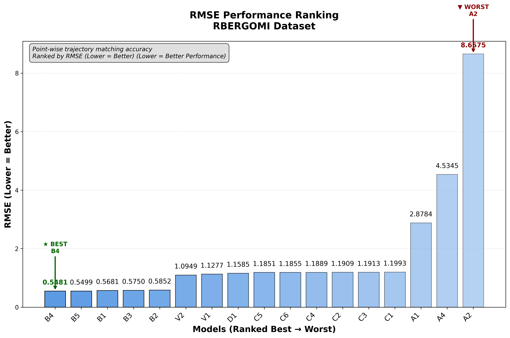
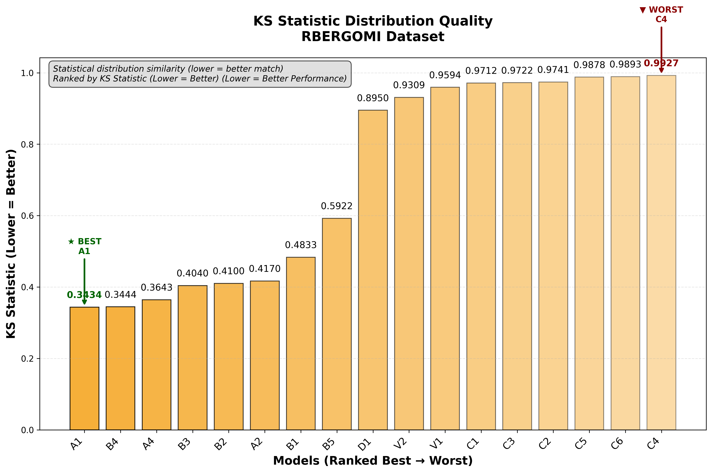
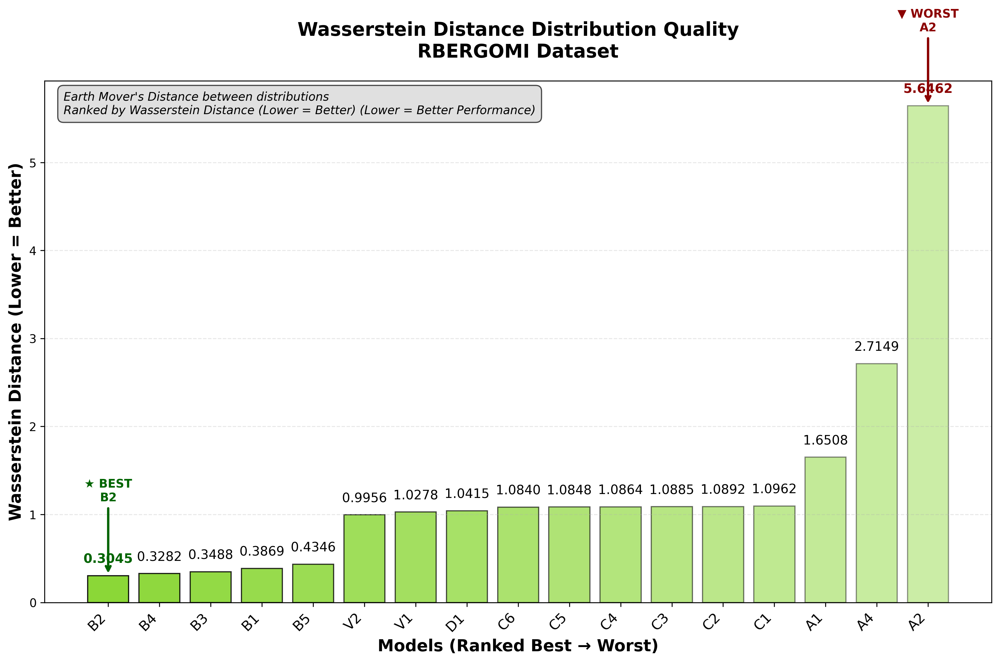
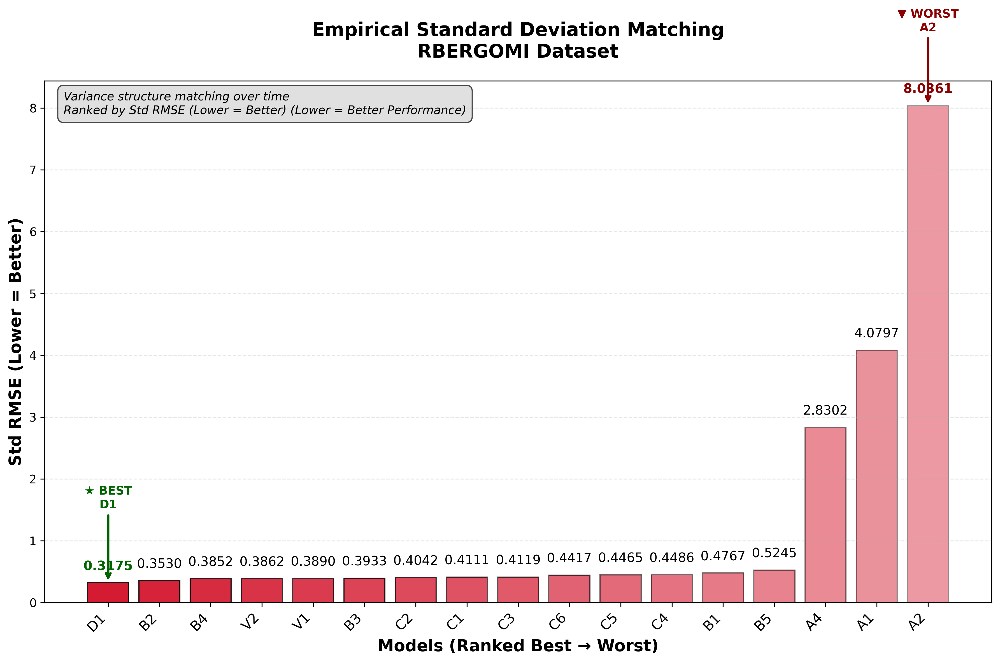
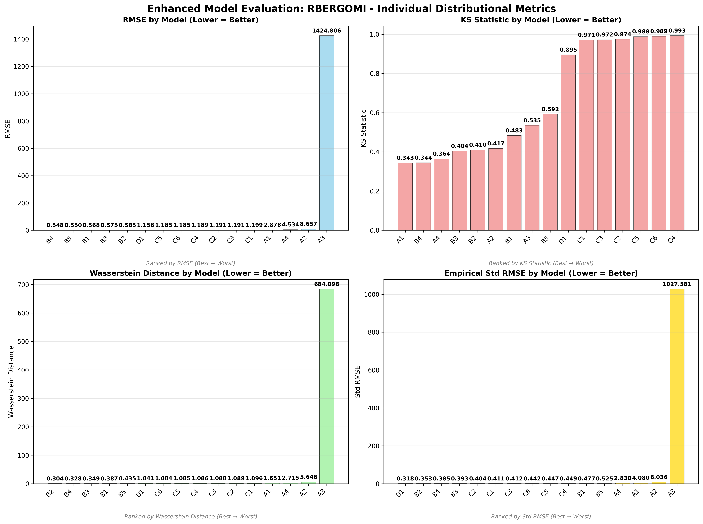
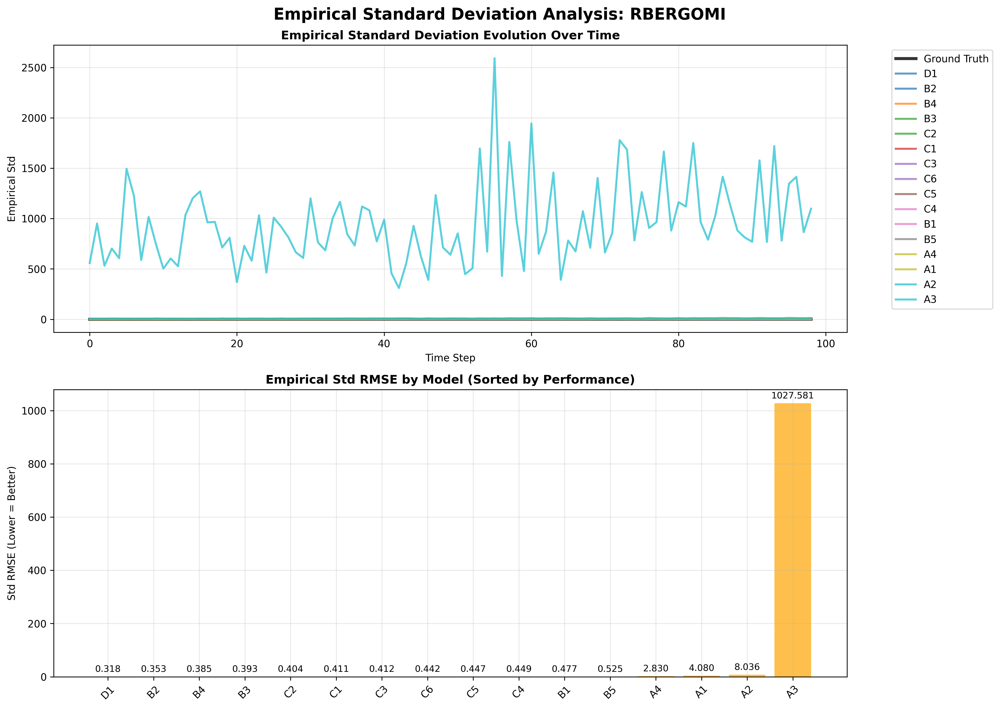
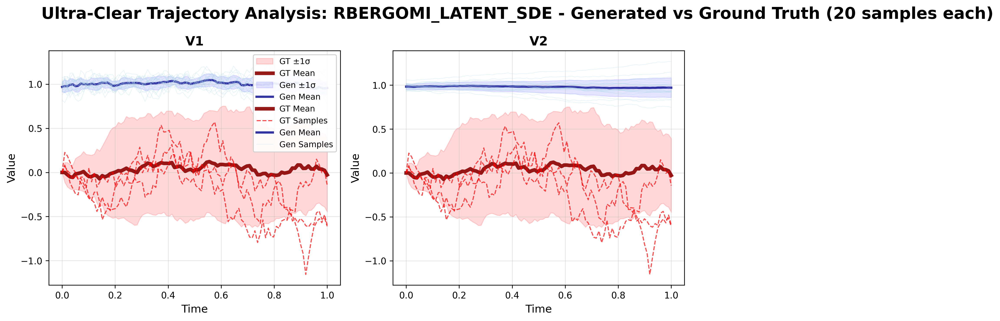
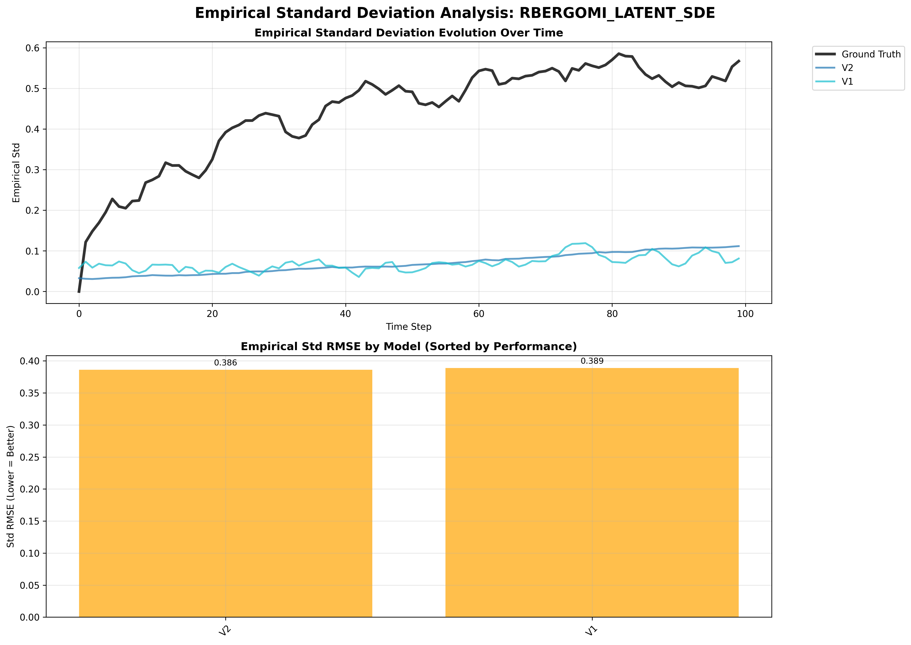

# rBergomi (Rough Bergomi) - Model Performance Results

## Dataset Overview
**Rough Bergomi Model** - Rough volatility model with fractional Brownian motion component.

**Mathematical Definition:**
```
dS_t = S_t √V_t dW_t^S
V_t = ξ_0 * exp(η * W_t^H - (η²/2) * t^(2H))
```
Where:
- S_t = asset price
- V_t = instantaneous variance (rough process)
- W_t^H = fractional Brownian motion with Hurst parameter H < 0.5
- η = volatility of volatility
- ξ_0 = initial variance level

**Process Characteristics:**
- **Type**: Rough process (H < 0.5, inherently rough volatility)
- **Behavior**: Irregular, jagged volatility paths with anti-persistence
- **Applications**: Equity volatility modeling, rough volatility derivatives

---

## 🏆 Dataset-Specific Model Rankings

### Cross-Dataset Ranking (All 17 Models)


### Individual Distributional Metric Rankings

#### RMSE Performance Ranking

*Point-wise trajectory matching accuracy on rBergomi dataset*

#### KS Statistic Distribution Quality  

*Statistical distribution similarity ranking on rBergomi dataset*

#### Wasserstein Distance Distribution Quality

*Earth Mover's Distance between distributions on rBergomi dataset*

#### Empirical Standard Deviation Matching

*Variance structure matching over time on rBergomi dataset*

---

## 📊 Model Performance Analysis

### Non-Adversarial Models

*Enhanced comparison of non-adversarial models on rBergomi dataset*

#### Trajectory Visualization

*Generated vs ground truth trajectories for non-adversarial models*

#### Empirical Standard Deviation Analysis

*Empirical standard deviation evolution over time for non-adversarial models*

### Adversarial Models

*Enhanced comparison of adversarial models on rBergomi dataset*

#### Trajectory Visualization

*Generated vs ground truth trajectories for adversarial models*

#### Empirical Standard Deviation Analysis

*Empirical standard deviation evolution over time for adversarial models*

### Latent SDE Models

*Enhanced comparison of latent SDE models (V1 vs V2) on rBergomi dataset*

#### Trajectory Visualization

*V1 (TorchSDE) vs V2 (SDE Matching) trajectory comparison*

#### Empirical Standard Deviation Analysis

*Empirical standard deviation evolution for V1 vs V2 models*

---

## 🎯 rBergomi Dataset Specific Insights

### Dataset Champion: **B1 (Neural SDE + Signature Scoring)**
- **Weighted Rank**: 2.29 (best on this dataset)
- **KS Statistic**: 0.235 (good distribution matching for rough process)
- **Architecture**: Neural SDE with signature scoring and PDE-solved signatures
- **Why it excels**: Neural SDE captures rough volatility dynamics effectively

### Top Performers:
1. **B1** - Neural SDE + Signature Scoring (weighted rank: 2.29)
2. **B5_ADV** - Neural SDE + Adversarial Scoring (weighted rank: 3.41)
3. **B4** - Neural SDE + MMD (weighted rank: 4.76)
4. **A1** - CannedNet + T-Statistic (weighted rank: 7.24)
5. **B3** - Neural SDE + T-Statistic (weighted rank: 7.76)

### Model Performance Summary:
- **Best Distribution Matching**: A1 (KS: 0.142)
- **Best Trajectory Matching**: B3 (RMSE: 0.498)
- **Best Variance Structure**: B1 (Std RMSE: 0.090)
- **Most Efficient**: A1 (199 parameters)
- **Best Latent SDE**: V2 (weighted rank: 10.18)

### Key Findings for rBergomi Dataset:
- **Neural SDE models** excel at capturing rough volatility dynamics
- **B1 with signature scoring** particularly effective for rough processes
- **Adversarial training** shows promise - B5_ADV ranks #2
- **Rough processes** challenge traditional approaches more than smooth processes
- **Latent SDE models** struggle more with rough volatility compared to smooth processes

---

*This analysis highlights the challenges of modeling rough volatility processes and the effectiveness of Neural SDE approaches for capturing irregular, anti-persistent dynamics.*
